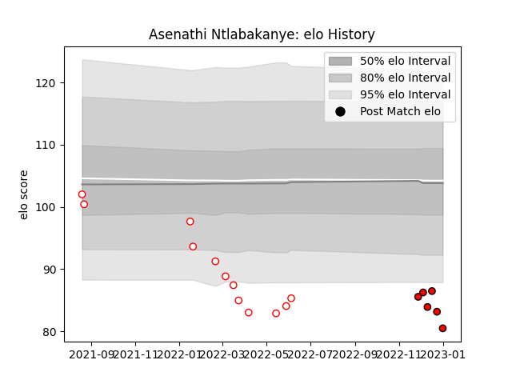

---  
layout: page  
title: Asenathi Ntlabakanye  
date: 2023-01-06 00:13:45.754130  
categories: player  
---
# Asenathi Ntlabakanye

## Positions: P

## Current elo: 80.0

## Current Percentile: 2.0

# Elo History

# Match History

| Team         |   Appearances |   Win Rate |
|:-------------|--------------:|-----------:|
| Golden Lions |            12 |   0.166667 |
| Lions        |             6 |   0.583333 |

| Opponent             |   Matches |   Win Rate |
|:---------------------|----------:|-----------:|
| Natal Sharks         |         3 |   0.333333 |
| Western Province     |         3 |   0.333333 |
| Blue Bulls           |         2 |   0        |
| Dragons              |         2 |   0.75     |
| Pumas                |         2 |   0        |
| Free State Cheetahs  |         1 |   0        |
| Griquas              |         1 |   0        |
| Scarlets             |         1 |   1        |
| Sharks               |         1 |   0        |
| Stade Francais Paris |         1 |   1        |
| Stormers             |         1 |   0        |