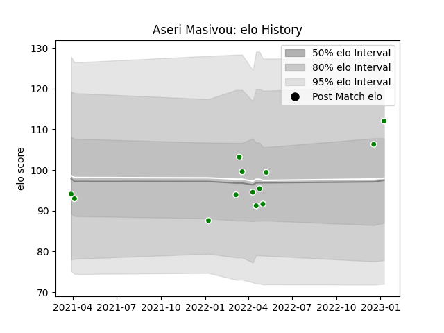

---  
layout: page  
title: Aseri Masivou  
date: 2023-02-02 18:50:09.135549  
categories: player  
---
# Aseri Masivou

## Positions: N8, FL

## Current elo: 98.0

## Current Percentile: 63.0

# Elo History

# Match History

| Team                  |   Appearances |   Win Rate |
|:----------------------|--------------:|-----------:|
| Green Rockets Tokatsu |            16 |     0.0625 |

| Opponent                          |   Matches |   Win Rate |
|:----------------------------------|----------:|-----------:|
| Yokohama Canon Eagles             |         3 |          0 |
| Black Rams Tokyo                  |         2 |          0 |
| Kobelco Kobe Steelers             |         2 |          0 |
| Kubota Spears Funabashi Tokyo-Bay |         2 |          0 |
| Saitama Wild Knights              |         2 |          0 |
| Hanazono Kintetsu Liners          |         1 |          1 |
| NTT Docomo Red Hurricanes Osaka   |         1 |          0 |
| Shizuoka Blue Revs                |         1 |          0 |
| Toshiba Brave Lupus Tokyo         |         1 |          0 |
| Urayasu D-Rocks                   |         1 |          0 |