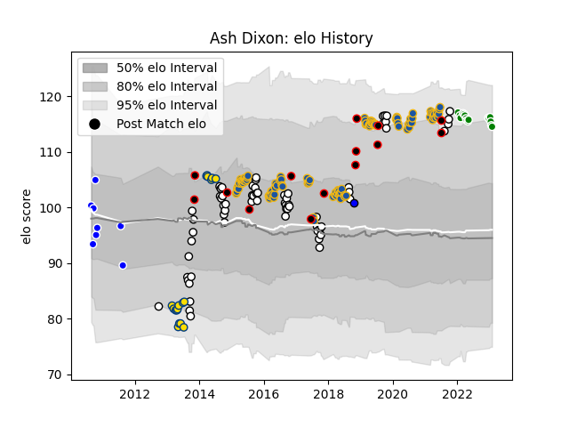

---  
layout: page  
title: Ash Dixon  
date: 2023-02-02 18:55:44.076049  
categories: player  
---
# Ash Dixon

## Positions: H

## Country: New Zealand Maori

## Current elo: 115.0

## Current Percentile: 88.0

# Elo History

# Match History

| Team                  |   Appearances |   Win Rate |
|:----------------------|--------------:|-----------:|
| Highlanders           |            99 |   0.575758 |
| Hawke's Bay           |            65 |   0.538462 |
| Hurricanes            |            18 |   0.388889 |
| Green Rockets Tokatsu |            16 |   0.0625   |
| New Zealand Maori     |            14 |   0.857143 |
| Auckland              |             8 |   0.75     |
| Saitama Wild Knights  |             1 |   1        |

| Opponent                          |   Matches |   Win Rate |
|:----------------------------------|----------:|-----------:|
| Chiefs                            |        17 |   0.617647 |
| Crusaders                         |        16 |   0.3125   |
| Hurricanes                        |        13 |   0.307692 |
| Blues                             |        12 |   0.5      |
| New South Wales Waratahs          |         9 |   0.777778 |
| Wellington                        |         8 |   0.8125   |
| Counties Manukau                  |         8 |   0.5      |
| Southland                         |         7 |   0.785714 |
| Otago                             |         7 |   1        |
| Bay of Plenty                     |         7 |   0.428571 |
| Tasman                            |         7 |   0.142857 |
| Brumbies                          |         7 |   0.714286 |
| Taranaki                          |         6 |   0.333333 |
| Bulls                             |         6 |   0.583333 |
| Queensland Reds                   |         6 |   0.833333 |
| Northland                         |         6 |   0.666667 |
| Manawatu                          |         6 |   0.666667 |
| Lions                             |         5 |   0.4      |
| Sharks                            |         4 |   0.25     |
| Waikato                           |         4 |   0.25     |
| Western Force                     |         4 |   1        |
| Melbourne Rebels                  |         4 |   0.5      |
| Yokohama Canon Eagles             |         4 |   0.25     |
| Highlanders                       |         4 |   0.25     |
| Kubota Spears Funabashi Tokyo-Bay |         3 |   0        |
| Kobelco Kobe Steelers             |         3 |   0        |
| United States of America          |         3 |   1        |
| North Harbour                     |         3 |   0.666667 |
| Stormers                          |         3 |   0.333333 |
| Fiji                              |         3 |   0.666667 |
| Cheetahs                          |         3 |   1        |
| Canada                            |         2 |   1        |
| Canterbury                        |         2 |   0        |
| Auckland                          |         2 |   0.5      |
| Samoa                             |         2 |   1        |
| Jaguares                          |         2 |   1        |
| Chile                             |         1 |   1        |
| Shizuoka Blue Revs                |         1 |   0        |
| Saitama Wild Knights              |         1 |   0        |
| Hanazono Kintetsu Liners          |         1 |   1        |
| Sunwolves                         |         1 |   1        |
| NTT Docomo Red Hurricanes Osaka   |         1 |   0        |
| Tokyo Sungoliath                  |         1 |   0        |
| Toyota Verblitz                   |         1 |   0        |
| Japan                             |         1 |   1        |
| British and Irish Lions           |         1 |   0        |
| Brazil                            |         1 |   1        |
| Black Rams Tokyo                  |         1 |   0        |
| Southern Kings                    |         1 |   1        |