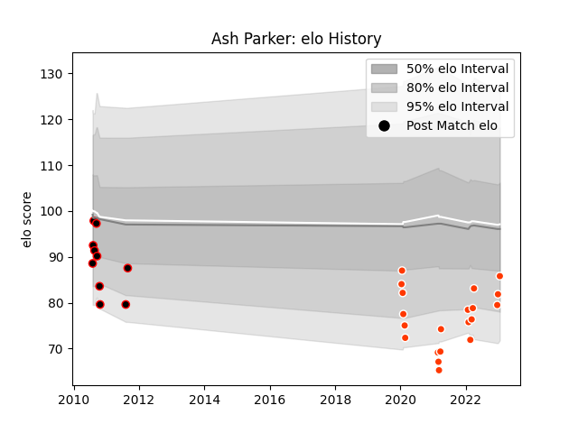

---  
layout: page  
title: Ash Parker  
date: 2022-12-18 16:31:38.334423  
categories: player  
---
# Ash Parker

## Positions: FL, N8

## Current elo: 87.0

## Current Percentile: 12.0

# Elo History

# Match History

| Team              |   Appearances |   Win Rate |
|:------------------|--------------:|-----------:|
| Hino Red Dolphins |            18 |   0.222222 |
| Canterbury        |             9 |   0.611111 |

| Opponent                          |   Matches |   Win Rate |
|:----------------------------------|----------:|-----------:|
| Kamaishi Seawaves                 |         2 |        1   |
| Mie Honda Heat                    |         2 |        0   |
| Mitsubishi Dynaboars              |         2 |        0   |
| Shizuoka Blue Revs                |         2 |        0   |
| Green Rockets Tokatsu             |         2 |        1   |
| Counties Manukau                  |         1 |        1   |
| Otago                             |         1 |        1   |
| Urayasu D-Rocks                   |         1 |        0   |
| Toyota Verblitz                   |         1 |        0   |
| Tokyo Sungoliath                  |         1 |        0   |
| Tasman                            |         1 |        0   |
| Taranaki                          |         1 |        0   |
| Saitama Wild Knights              |         1 |        0   |
| North Harbour                     |         1 |        1   |
| Northland                         |         1 |        1   |
| NTT Docomo Red Hurricanes Osaka   |         1 |        0   |
| Manawatu                          |         1 |        1   |
| Kubota Spears Funabashi Tokyo-Bay |         1 |        0   |
| Kobelco Kobe Steelers             |         1 |        0   |
| Hawke's Bay                       |         1 |        0.5 |
| Hanazono Kintetsu Liners          |         1 |        0   |
| Waikato                           |         1 |        0   |