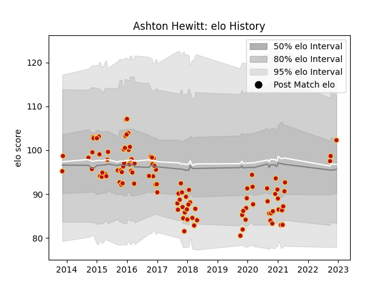

---  
layout: page  
title: Ashton Hewitt  
date: 2022-12-18 16:22:48.834878  
categories: player  
---
# Ashton Hewitt

## Positions: W

## Current elo: 98.0

## Current Percentile: 74.0

# Elo History

# Match History

| Team    |   Appearances |   Win Rate |
|:--------|--------------:|-----------:|
| Dragons |           106 |   0.334906 |

| Opponent             |   Matches |   Win Rate |
|:---------------------|----------:|-----------:|
| Ospreys              |        10 |   0.25     |
| Scarlets             |         8 |   0.25     |
| Munster              |         8 |   0.25     |
| Edinburgh            |         8 |   0.375    |
| Glasgow Warriors     |         7 |   0.428571 |
| Leinster             |         7 |   0.142857 |
| Benetton Treviso     |         6 |   0.333333 |
| Ulster               |         6 |   0.25     |
| Cardiff Blues        |         6 |   0        |
| Worcester Warriors   |         5 |   0.6      |
| Zebre                |         4 |   0.5      |
| Connacht             |         4 |   0.5      |
| Pau                  |         3 |   0.666667 |
| Southern Kings       |         2 |   0.5      |
| Bordeaux Begles      |         2 |   0.5      |
| Newcastle Falcons    |         2 |   0        |
| Cheetahs             |         2 |   0.5      |
| Sale Sharks          |         2 |   0.5      |
| Castres Olympique    |         2 |   0.5      |
| Harlequins           |         1 |   0        |
| Bristol Rugby        |         1 |   0        |
| Wasps                |         1 |   1        |
| Brive                |         1 |   1        |
| Stade Francais Paris |         1 |   1        |
| RC Enisei            |         1 |   0        |
| Sharks               |         1 |   0        |
| Leicester Tigers     |         1 |   0        |
| Northampton Saints   |         1 |   0        |
| Lions                |         1 |   0.5      |
| Exeter Chiefs        |         1 |   0        |
| London Welsh         |         1 |   1        |