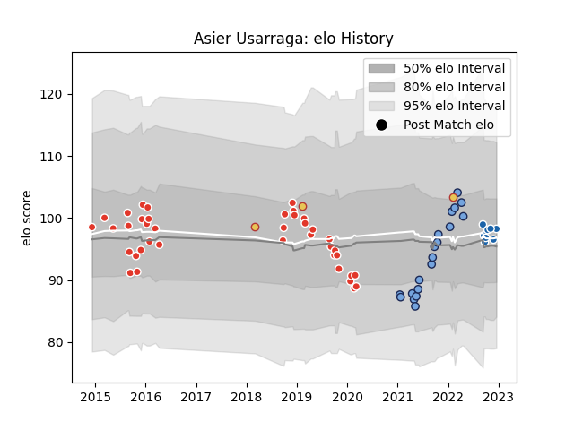

---  
layout: page  
title: Asier Usarraga  
date: 2023-01-06 00:13:07.123083  
categories: player  
---
# Asier Usarraga

## Positions: FL

## Country: Spain

## Current elo: 107.0

## Current Percentile: 61.0

# Elo History

# Match History

| Team               |   Appearances |   Win Rate |
|:-------------------|--------------:|-----------:|
| Biarritz Olympique |            84 |    0.52381 |
| Bayonne            |            25 |    0.6     |
| Castres Olympique  |            10 |    0.35    |
| Spain              |             4 |    0.5     |

| Opponent             |   Matches |   Win Rate |
|:---------------------|----------:|-----------:|
| Vannes               |         7 |   0.571429 |
| Aurillac             |         7 |   0.428571 |
| Beziers              |         7 |   0.714286 |
| Carcassonne          |         7 |   0.571429 |
| Provence Rugby       |         6 |   0.666667 |
| Colomiers            |         6 |   0.5      |
| Mont-de-Marsan       |         5 |   0.8      |
| Bayonne              |         5 |   0.6      |
| Perpignan            |         5 |   0.4      |
| Oyonnax              |         5 |   0.8      |
| Narbonne             |         5 |   1        |
| Montauban            |         4 |   0.5      |
| Bourgoin-Jallieu     |         3 |   0.666667 |
| Grenoble             |         3 |   0.5      |
| US Bressane          |         3 |   0.666667 |
| Tarbes               |         3 |   0.333333 |
| Dax                  |         3 |   0.666667 |
| Albi                 |         3 |   0        |
| Soyaux-Angouleme     |         3 |   0.666667 |
| Nevers               |         3 |   0.333333 |
| Brive                |         3 |   0.5      |
| Pau                  |         2 |   0        |
| Stade Toulousain     |         2 |   0.5      |
| Stade Francais Paris |         2 |   0.5      |
| Rouen                |         2 |   1        |
| Bordeaux Begles      |         2 |   0        |
| Agen                 |         2 |   0        |
| Massy                |         2 |   0.5      |
| Lyon                 |         2 |   0        |
| La Rochelle          |         2 |   0        |
| Georgia              |         1 |   0        |
| Racing 92            |         1 |   0.5      |
| Netherlands          |         1 |   1        |
| Roval Drome XV       |         1 |   1        |
| Russia               |         1 |   1        |
| Samoa                |         1 |   0        |
| Castres Olympique    |         1 |   0        |
| Montpellier Herault  |         1 |   0        |
| Edinburgh            |         1 |   0        |