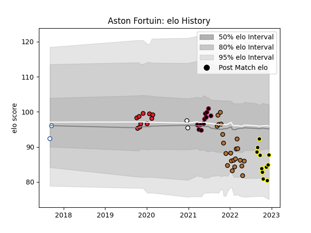

---  
layout: page  
title: Aston Fortuin  
date: 2022-11-22 11:31:15.848707  
categories: player  
---
# Aston Fortuin

## Positions: L

## Current elo: 85.0

## Current Percentile: 10.0

# Elo History

# Match History

| Team           |   Appearances |   Win Rate |
|:---------------|--------------:|-----------:|
| Narbonne       |            22 |   0.25     |
| Utah Warriors  |            11 |   0.636364 |
| Southern Kings |            10 |   0.1      |
| Mont-de-Marsan |             8 |   0.375    |
| Blue Bulls     |             2 |   0.5      |
| Natal Sharks   |             2 |   0        |

| Opponent               |   Matches |   Win Rate |
|:-----------------------|----------:|-----------:|
| Agen                   |         3 |   0.333333 |
| Provence Rugby         |         3 |   0.666667 |
| Beziers                |         3 |   0        |
| Montauban              |         3 |   0        |
| Aurillac               |         3 |   0.333333 |
| Golden Lions           |         2 |   0        |
| San Diego Legion       |         2 |   0.5      |
| Rouen                  |         2 |   0.5      |
| Oyonnax                |         2 |   0.5      |
| Nevers                 |         2 |   0        |
| Munster                |         2 |   0        |
| Houston SaberCats      |         2 |   1        |
| Grenoble               |         2 |   0.25     |
| L. A. Giltinis         |         2 |   0.5      |
| Carcassonne            |         2 |   0        |
| Bayonne                |         2 |   0        |
| Glasgow Warriors       |         1 |   0        |
| Benetton Treviso       |         1 |   0        |
| US Bressane            |         1 |   1        |
| Soyaux-Angouleme       |         1 |   1        |
| Seattle Seawolves      |         1 |   1        |
| Scarlets               |         1 |   0        |
| Austin Gilgronis       |         1 |   1        |
| Austin Herd            |         1 |   1        |
| Ospreys                |         1 |   1        |
| Griquas                |         1 |   1        |
| New England Free Jacks |         1 |   0        |
| NOLA Gold              |         1 |   0        |
| Cheetahs               |         1 |   0        |
| Connacht               |         1 |   0        |
| Mont-de-Marsan         |         1 |   0        |
| Edinburgh              |         1 |   0        |
| Free State Cheetahs    |         1 |   0        |
| Ulster                 |         1 |   0        |