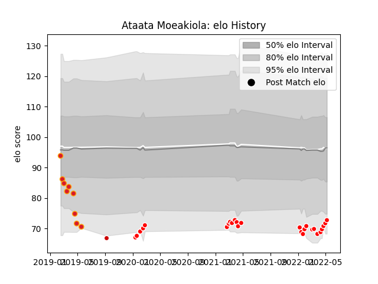

---  
layout: page  
title: Ataata Moeakiola  
date: 2023-03-21 18:16:27.543129  
categories: player  
---
# Ataata Moeakiola

Last updated: 2023-03-21
## Positions: W, C

## Country: Japan

## Current elo: 73.0

## Current Percentile: 5.0

# Elo History

# Match History

| Team                  |   Appearances |   Win Rate |
|:----------------------|--------------:|-----------:|
| Kobelco Kobe Steelers |            26 |   0.711538 |
| Chiefs                |             9 |   0.277778 |
| Japan                 |             1 |   0        |

| Opponent                          |   Matches |   Win Rate |
|:----------------------------------|----------:|-----------:|
| Yokohama Canon Eagles             |         4 |   0.75     |
| Green Rockets Tokatsu             |         3 |   1        |
| Saitama Wild Knights              |         3 |   0.166667 |
| Black Rams Tokyo                  |         3 |   1        |
| Hurricanes                        |         2 |   0.25     |
| Kubota Spears Funabashi Tokyo-Bay |         2 |   0.5      |
| Blues                             |         2 |   0.5      |
| NTT Docomo Red Hurricanes Osaka   |         2 |   1        |
| Shizuoka Blue Revs                |         2 |   1        |
| Toshiba Brave Lupus Tokyo         |         2 |   0.5      |
| Urayasu D-Rocks                   |         2 |   0.5      |
| Bulls                             |         1 |   1        |
| Highlanders                       |         1 |   0        |
| Hino Red Dolphins                 |         1 |   1        |
| Lions                             |         1 |   0        |
| Brumbies                          |         1 |   0        |
| South Africa                      |         1 |   0        |
| Sunwolves                         |         1 |   0        |
| Tokyo Sungoliath                  |         1 |   0        |
| Mitsubishi Dynaboars              |         1 |   1        |