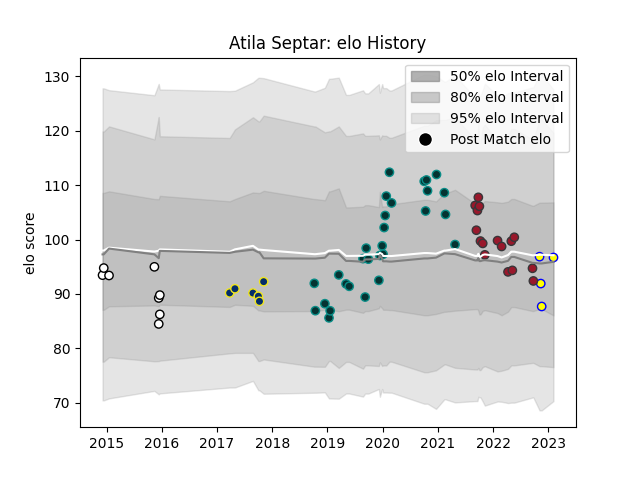

---  
layout: page  
title: Atila Septar  
date: 2023-03-21 18:11:12.313039  
categories: player  
---
# Atila Septar

Last updated: 2023-03-21
## Positions: W, C

## Country: Romania

## Current elo: 83.0

## Current Percentile: 29.0

# Elo History

# Match History

| Team              |   Appearances |   Win Rate |
|:------------------|--------------:|-----------:|
| Pau               |            29 |   0.362069 |
| Toulon            |            16 |   0.40625  |
| Brive             |             8 |   0.375    |
| Clermont Auvergne |             6 |   0.166667 |
| Romania           |             3 |   0.333333 |

| Opponent               |   Matches |   Win Rate |
|:-----------------------|----------:|-----------:|
| Clermont Auvergne      |         6 |   0.333333 |
| Brive                  |         5 |   0.4      |
| Stade Francais Paris   |         5 |   0.2      |
| Stade Toulousain       |         5 |   0        |
| Bordeaux Begles        |         4 |   0.5      |
| Montpellier Herault    |         3 |   0.5      |
| Perpignan              |         3 |   0.333333 |
| London Irish           |         2 |   0.5      |
| Oyonnax                |         2 |   0        |
| Ospreys                |         2 |   0.5      |
| Lyon                   |         2 |   0.75     |
| La Rochelle            |         2 |   0        |
| Enisey-STM Krasnoyarsk |         2 |   0.5      |
| Castres Olympique      |         2 |   0        |
| Cardiff Blues          |         2 |   0.5      |
| RC Enisei              |         2 |   0.5      |
| Toulon                 |         1 |   0        |
| Racing 92              |         1 |   0        |
| Uruguay                |         1 |   0        |
| Samoa                  |         1 |   0        |
| Worcester Warriors     |         1 |   0        |
| Agen                   |         1 |   1        |
| Pau                    |         1 |   1        |
| Newcastle Falcons      |         1 |   1        |
| Biarritz Olympique     |         1 |   0        |
| Leicester Tigers       |         1 |   1        |
| Chile                  |         1 |   1        |
| Calvisano              |         1 |   1        |
| Zebre                  |         1 |   0        |