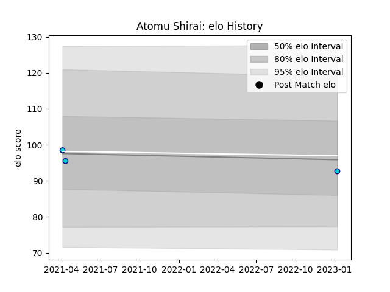

---  
layout: page  
title: Atomu Shirai  
date: 2023-01-13 11:36:34.182323  
categories: player  
---
# Atomu Shirai

## Positions: C

## Current elo: 93.0

## Current Percentile: None

# Elo History

# Match History

| Team               |   Appearances |   Win Rate |
|:-------------------|--------------:|-----------:|
| Shizuoka Blue Revs |             3 |   0.333333 |

| Opponent                        |   Matches |   Win Rate |
|:--------------------------------|----------:|-----------:|
| NTT Docomo Red Hurricanes Osaka |         1 |          1 |
| Saitama Wild Knights            |         1 |          0 |
| Toshiba Brave Lupus Tokyo       |         1 |          0 |