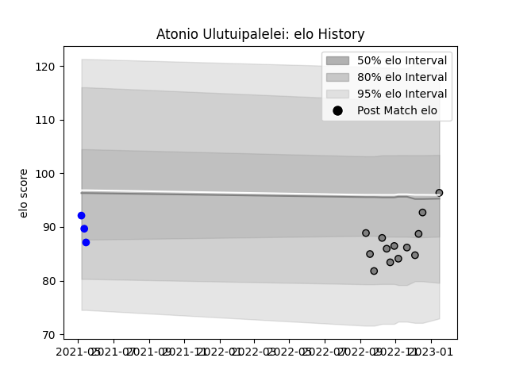

---  
layout: page  
title: Atonio Ulutuipalelei  
date: 2023-03-21 18:37:16.479681  
categories: player  
---
# Atonio Ulutuipalelei

Last updated: 2023-03-21
## Positions: P

## Current elo: 88.0

## Current Percentile: 26.0

# Elo History

# Match History

| Team   |   Appearances |   Win Rate |
|:-------|--------------:|-----------:|
| Rennes |            18 |   0.222222 |
| Vannes |             3 |   0        |

| Opponent                   |   Matches |   Win Rate |
|:---------------------------|----------:|-----------:|
| Albi                       |         2 |        0   |
| Blagnac                    |         2 |        0   |
| Chambery                   |         2 |        0.5 |
| Cognac Saint Jean d'Angély |         2 |        1   |
| Tarbes                     |         2 |        0   |
| US Bressane                |         2 |        0   |
| Valence Romans Drome Rugby |         2 |        0   |
| Bourgoin-Jallieu           |         1 |        0   |
| Carqueiranne-Hyères        |         1 |        1   |
| Dax                        |         1 |        0   |
| Grenoble                   |         1 |        0   |
| Nice                       |         1 |        0   |
| Oyonnax                    |         1 |        0   |
| Perpignan                  |         1 |        0   |