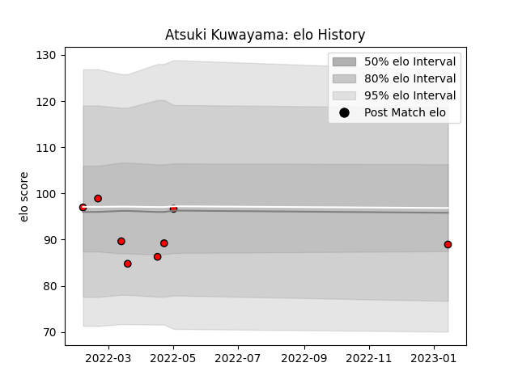

---  
layout: page  
title: Atsuki Kuwayama  
date: 2023-03-17 17:32:31.724095  
categories: player  
---
# Atsuki Kuwayama

## Positions: W, C

## Current elo: 98.0

## Current Percentile: 56.0

# Elo History

# Match History

| Team                      |   Appearances |   Win Rate |
|:--------------------------|--------------:|-----------:|
| Toshiba Brave Lupus Tokyo |            14 |   0.571429 |

| Opponent                          |   Matches |   Win Rate |
|:----------------------------------|----------:|-----------:|
| Black Rams Tokyo                  |         2 |        0.5 |
| Green Rockets Tokatsu             |         2 |        1   |
| Kubota Spears Funabashi Tokyo-Bay |         2 |        0   |
| Mie Honda Heat                    |         1 |        1   |
| Mitsubishi Dynaboars              |         1 |        0   |
| Munakata Sanix Blues              |         1 |        1   |
| NTT Docomo Red Hurricanes Osaka   |         1 |        1   |
| Saitama Wild Knights              |         1 |        0   |
| Shizuoka Blue Revs                |         1 |        1   |
| Tokyo Sungoliath                  |         1 |        1   |
| Yokohama Canon Eagles             |         1 |        0   |