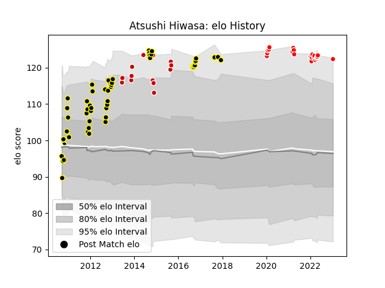

---  
layout: page  
title: Atsushi Hiwasa  
date: 2023-01-15 12:01:58.717233  
categories: player  
---
# Atsushi Hiwasa

## Positions: SH

## Country: Japan

## Current elo: 122.0

## Current Percentile: 94.0

# Elo History

# Match History

| Team                  |   Appearances |   Win Rate |
|:----------------------|--------------:|-----------:|
| Tokyo Sungoliath      |            54 |   0.925926 |
| Kobelco Kobe Steelers |            22 |   0.613636 |
| Japan                 |            15 |   0.666667 |

| Opponent                          |   Matches |   Win Rate |
|:----------------------------------|----------:|-----------:|
| Black Rams Tokyo                  |         9 |   1        |
| Saitama Wild Knights              |         8 |   0.5625   |
| Yokohama Canon Eagles             |         7 |   0.857143 |
| Green Rockets Tokatsu             |         6 |   0.833333 |
| Shizuoka Blue Revs                |         5 |   1        |
| Hanazono Kintetsu Liners          |         5 |   1        |
| Kobelco Kobe Steelers             |         4 |   0.75     |
| Toshiba Brave Lupus Tokyo         |         4 |   0.5      |
| Munakata Sanix Blues              |         4 |   1        |
| NTT Docomo Red Hurricanes Osaka   |         4 |   1        |
| Urayasu D-Rocks                   |         4 |   0.75     |
| Kubota Spears Funabashi Tokyo-Bay |         3 |   0.666667 |
| Tokyo Sungoliath                  |         3 |   0.333333 |
| Toyota Verblitz                   |         3 |   1        |
| Georgia                           |         3 |   0.666667 |
| Uruguay                           |         2 |   1        |
| Romania                           |         2 |   1        |
| Coca-Cola Red Sparks              |         2 |   1        |
| New Zealand Maori                 |         2 |   0        |
| Mie Honda Heat                    |         2 |   1        |
| Wales                             |         2 |   0.5      |
| Toyota Industries Shuttles Aichi  |         2 |   1        |
| Samoa                             |         1 |   1        |
| Spain                             |         1 |   1        |
| Scotland                          |         1 |   0        |
| Kyuden Voltex                     |         1 |   1        |
| Russia                            |         1 |   1        |