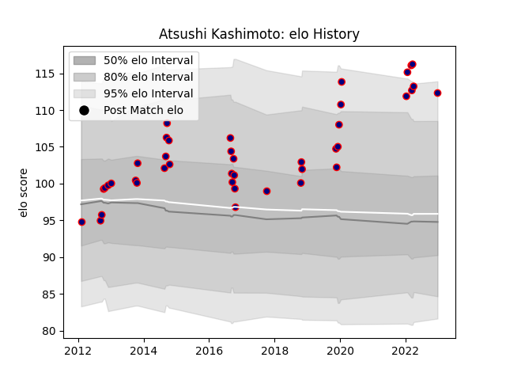

---  
layout: page  
title: Atsushi Kashimoto  
date: 2023-02-02 18:57:02.425634  
categories: player  
---
# Atsushi Kashimoto

## Positions: H

## Current elo: 114.0

## Current Percentile: 96.0

# Elo History

# Match History

| Team                     |   Appearances |   Win Rate |
|:-------------------------|--------------:|-----------:|
| Hanazono Kintetsu Liners |            45 |   0.577778 |

| Opponent                          |   Matches |   Win Rate |
|:----------------------------------|----------:|-----------:|
| Black Rams Tokyo                  |         4 |   0.75     |
| Mitsubishi Dynaboars              |         3 |   0.333333 |
| Toshiba Brave Lupus Tokyo         |         3 |   0        |
| Tokyo Sungoliath                  |         3 |   0        |
| NTT Docomo Red Hurricanes Osaka   |         3 |   1        |
| Coca-Cola Red Sparks              |         3 |   1        |
| Munakata Sanix Blues              |         3 |   0.666667 |
| Yokohama Canon Eagles             |         2 |   0        |
| Mie Honda Heat                    |         2 |   1        |
| Kubota Spears Funabashi Tokyo-Bay |         2 |   0.5      |
| Toyota Verblitz                   |         2 |   0.5      |
| Kamaishi Seawaves                 |         2 |   1        |
| Saitama Wild Knights              |         2 |   0        |
| Hino Red Dolphins                 |         1 |   1        |
| Urayasu D-Rocks                   |         1 |   0        |
| Toyota Industries Shuttles Aichi  |         1 |   1        |
| Green Rockets Tokatsu             |         1 |   1        |
| Kurita Water Gush                 |         1 |   1        |
| Skyactivs Hiroshima               |         1 |   1        |
| Shizuoka Blue Revs                |         1 |   0        |
| Kyuden Voltex                     |         1 |   1        |
| Kobelco Kobe Steelers             |         1 |   0        |
| Mazda Blue Zoomers                |         1 |   1        |
| Shimizu Blue Sharks               |         1 |   1        |