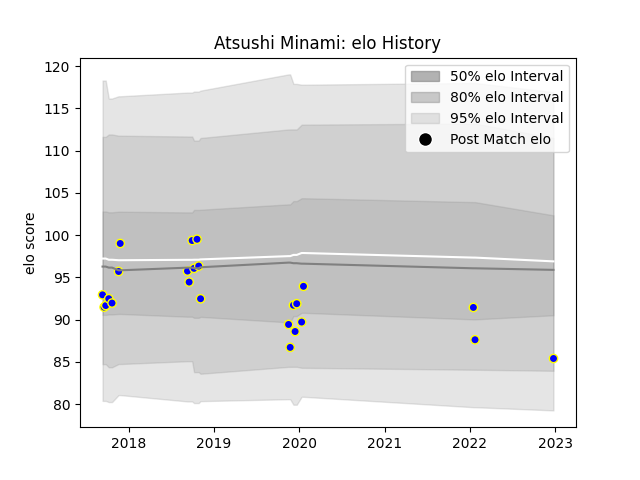

---  
layout: page  
title: Atsushi Minami  
date: 2022-12-31 16:26:45.968988  
categories: player  
---
# Atsushi Minami

## Positions: SH

## Current elo: 86.0

## Current Percentile: 15.0

# Elo History

# Match History

| Team              |   Appearances |   Win Rate |
|:------------------|--------------:|-----------:|
| Kamaishi Seawaves |            24 |   0.333333 |

| Opponent                         |   Matches |   Win Rate |
|:---------------------------------|----------:|-----------:|
| Kyuden Voltex                    |         3 |   0.333333 |
| Mazda Blue Zoomers               |         3 |   0.5      |
| Mie Honda Heat                   |         3 |   0        |
| Chugoku Red Regulions            |         2 |   1        |
| Hanazono Kintetsu Liners         |         2 |   0        |
| Hino Red Dolphins                |         2 |   0        |
| Kurita Water Gush                |         2 |   0.5      |
| Mitsubishi Dynaboars             |         2 |   0        |
| Chubu Electric Power             |         1 |   1        |
| Coca-Cola Red Sparks             |         1 |   0.5      |
| NTT Docomo Red Hurricanes Osaka  |         1 |   0        |
| Shimizu Blue Sharks              |         1 |   1        |
| Toyota Industries Shuttles Aichi |         1 |   0        |