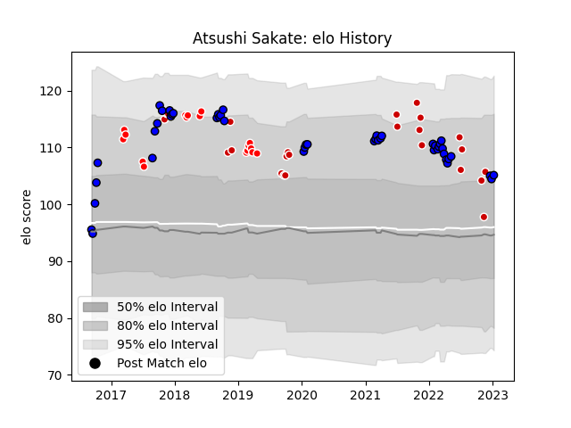

---  
layout: page  
title: Atsushi Sakate  
date: 2023-02-02 18:52:27.798509  
categories: player  
---
# Atsushi Sakate

## Positions: H

## Country: Japan

## Current elo: 107.0

## Current Percentile: 80.0

# Elo History

# Match History

| Team                 |   Appearances |   Win Rate |
|:---------------------|--------------:|-----------:|
| Saitama Wild Knights |            49 |  0.94898   |
| Japan                |            24 |  0.354167  |
| Sunwolves            |            17 |  0.0588235 |

| Opponent                          |   Matches |   Win Rate |
|:----------------------------------|----------:|-----------:|
| Yokohama Canon Eagles             |         6 |   1        |
| Black Rams Tokyo                  |         5 |   0.8      |
| Shizuoka Blue Revs                |         4 |   1        |
| France                            |         4 |   0.125    |
| Toyota Verblitz                   |         4 |   1        |
| Toshiba Brave Lupus Tokyo         |         3 |   1        |
| Ireland                           |         3 |   0.333333 |
| Lions                             |         3 |   0        |
| Coca-Cola Red Sparks              |         3 |   1        |
| Urayasu D-Rocks                   |         3 |   1        |
| Green Rockets Tokatsu             |         3 |   1        |
| Tokyo Sungoliath                  |         3 |   0.666667 |
| Kubota Spears Funabashi Tokyo-Bay |         3 |   1        |
| Kobelco Kobe Steelers             |         3 |   0.833333 |
| New Zealand                       |         2 |   0        |
| Sharks                            |         2 |   0        |
| Russia                            |         2 |   1        |
| Scotland                          |         2 |   0.5      |
| South Africa                      |         2 |   0        |
| Stormers                          |         2 |   0        |
| NTT Docomo Red Hurricanes Osaka   |         2 |   1        |
| Australia                         |         2 |   0        |
| England                           |         2 |   0        |
| Melbourne Rebels                  |         2 |   0        |
| Mitsubishi Dynaboars              |         2 |   1        |
| New South Wales Waratahs          |         1 |   0        |
| Portugal                          |         1 |   1        |
| Uruguay                           |         1 |   1        |
| Blues                             |         1 |   0        |
| British and Irish Lions           |         1 |   0        |
| Toyota Industries Shuttles Aichi  |         1 |   1        |
| Brumbies                          |         1 |   0        |
| Tonga                             |         1 |   1        |
| Bulls                             |         1 |   0        |
| Cheetahs                          |         1 |   0        |
| Chiefs                            |         1 |   1        |
| Mie Honda Heat                    |         1 |   1        |
| Hanazono Kintetsu Liners          |         1 |   1        |
| Hino Red Dolphins                 |         1 |   1        |
| Samoa                             |         1 |   1        |
| Hurricanes                        |         1 |   0        |
| Queensland Reds                   |         1 |   0        |
| Munakata Sanix Blues              |         1 |   1        |