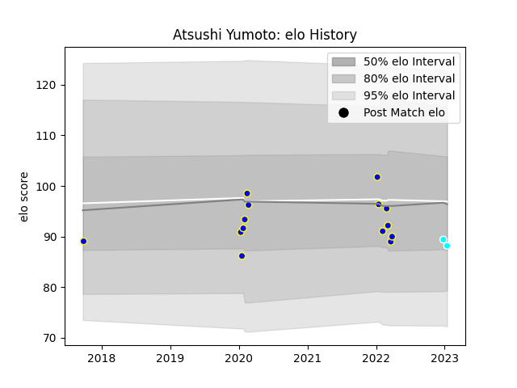

---  
layout: page  
title: Atsushi Yumoto  
date: 2023-01-15 11:52:38.488047  
categories: player  
---
# Atsushi Yumoto

## Positions: SH

## Current elo: 88.0

## Current Percentile: 30.0

# Elo History

# Match History

| Team                             |   Appearances |   Win Rate |
|:---------------------------------|--------------:|-----------:|
| Urayasu D-Rocks                  |            14 |   0.571429 |
| Toyota Industries Shuttles Aichi |             2 |   0.5      |

| Opponent                          |   Matches |   Win Rate |
|:----------------------------------|----------:|-----------:|
| Black Rams Tokyo                  |         2 |          1 |
| Hino Red Dolphins                 |         2 |          1 |
| Kubota Spears Funabashi Tokyo-Bay |         2 |          0 |
| Tokyo Sungoliath                  |         2 |          0 |
| Kobelco Kobe Steelers             |         1 |          1 |
| Mie Honda Heat                    |         1 |          1 |
| Munakata Sanix Blues              |         1 |          1 |
| Saitama Wild Knights              |         1 |          0 |
| Toshiba Brave Lupus Tokyo         |         1 |          1 |
| Toyota Industries Shuttles Aichi  |         1 |          1 |
| Toyota Verblitz                   |         1 |          0 |
| Urayasu D-Rocks                   |         1 |          0 |