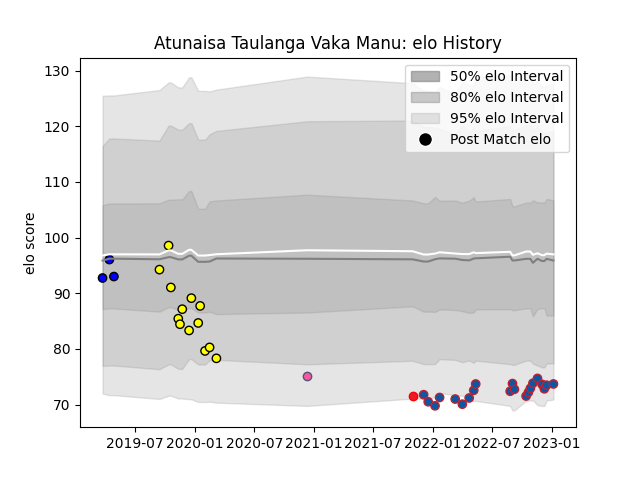

---  
layout: page  
title: Atunaisa Taulanga Vaka Manu  
date: 2022-12-09 13:07:57.591479  
categories: player  
---
# Atunaisa Taulanga Vaka Manu

## Positions: W, C

## Country: Tonga

## Current elo: 82.0

## Current Percentile: 10.0

# Elo History

# Match History

| Team        |   Appearances |   Win Rate |
|:------------|--------------:|-----------:|
| Grenoble    |            16 |   0.59375  |
| Carcassonne |             9 |   0.277778 |
| Massy       |             1 |   0        |
| Tonga       |             1 |   0        |

| Opponent           |   Matches |   Win Rate |
|:-------------------|----------:|-----------:|
| Oyonnax            |         3 |       0    |
| Bayonne            |         2 |       0.5  |
| Beziers            |         2 |       0.5  |
| Biarritz Olympique |         2 |       0.25 |
| Carcassonne        |         2 |       1    |
| Montauban          |         2 |       1    |
| Perpignan          |         2 |       0.5  |
| Provence Rugby     |         2 |       0    |
| Soyaux-Angouleme   |         2 |       0.75 |
| US Bressane        |         2 |       0.5  |
| Agen               |         1 |       1    |
| Colomiers          |         1 |       0    |
| Mont-de-Marsan     |         1 |       0    |
| Nevers             |         1 |       1    |
| Rouen              |         1 |       0    |
| Scotland           |         1 |       0    |