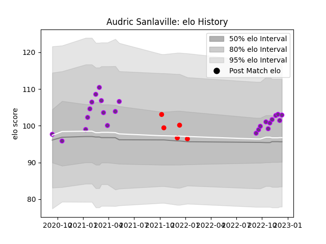

---  
layout: page  
title: Audric Sanlaville  
date: 2023-02-02 19:04:47.549094  
categories: player  
---
# Audric Sanlaville

## Positions: W

## Current elo: 76.0

## Current Percentile: 14.0

# Elo History

# Match History

| Team        |   Appearances |   Win Rate |
|:------------|--------------:|-----------:|
| US Bressane |            31 |  0.709677  |
| Rouen       |             6 |  0.0833333 |

| Opponent                   |   Matches |   Win Rate |
|:---------------------------|----------:|-----------:|
| Blagnac                    |         4 |   0.75     |
| Chambery                   |         3 |   0.666667 |
| Cognac Saint Jean d'Angély |         3 |   1        |
| Tarbes                     |         3 |   0.666667 |
| Suresnes                   |         3 |   1        |
| Albi                       |         2 |   0        |
| Bourgoin-Jallieu           |         2 |   1        |
| US Bressane                |         2 |   0.25     |
| Dax                        |         2 |   0.5      |
| Massy                      |         2 |   0.5      |
| Nice                       |         2 |   0.5      |
| Narbonne                   |         2 |   0.5      |
| Nevers                     |         1 |   0        |
| Grenoble                   |         1 |   0        |
| Mont-de-Marsan             |         1 |   0        |
| Beziers                    |         1 |   0        |
| Dijon                      |         1 |   1        |
| Carqueiranne-Hyères        |         1 |   1        |
| Valence Romans Drome Rugby |         1 |   1        |