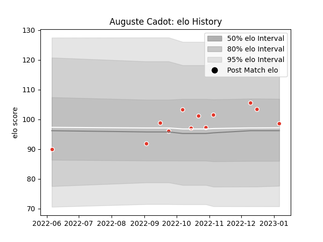

---  
layout: page  
title: Auguste Cadot  
date: 2022-12-14 11:23:16.551955  
categories: player  
---
# Auguste Cadot

## Positions: C

## Current elo: 99.0

## Current Percentile: 50.0

# Elo History

# Match History

| Team               |   Appearances |   Win Rate |
|:-------------------|--------------:|-----------:|
| Biarritz Olympique |            10 |       0.55 |

| Opponent         |   Matches |   Win Rate |
|:-----------------|----------:|-----------:|
| Agen             |         1 |        0   |
| Aurillac         |         1 |        1   |
| Carcassonne      |         1 |        1   |
| Colomiers        |         1 |        1   |
| Montauban        |         1 |        1   |
| Nevers           |         1 |        0.5 |
| Rouen            |         1 |        0   |
| Soyaux-Angouleme |         1 |        1   |
| Stade Toulousain |         1 |        0   |
| Vannes           |         1 |        0   |