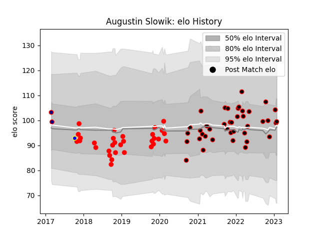

---  
layout: page  
title: Augustin Slowik  
date: 2023-03-17 17:01:31.529776  
categories: player  
---
# Augustin Slowik

## Positions: W, FB

## Current elo: 102.0

## Current Percentile: 57.0

# Elo History

# Match History

| Team            |   Appearances |   Win Rate |
|:----------------|--------------:|-----------:|
| Nice            |            43 |   0.604651 |
| Jersey          |            31 |   0.564516 |
| London Scottish |             2 |   0        |
| Sydney Rays     |             1 |   0        |

| Opponent                   |   Matches |   Win Rate |
|:---------------------------|----------:|-----------:|
| Chambery                   |         5 |   0.6      |
| Doncaster                  |         5 |   0.6      |
| Albi                       |         4 |   0.625    |
| Dax                        |         4 |   0.25     |
| Aubenas                    |         4 |   1        |
| Tarbes                     |         4 |   0.875    |
| Nottingham                 |         4 |   0.875    |
| Massy                      |         3 |   0.666667 |
| London Scottish            |         3 |   0.333333 |
| London Irish               |         3 |   0.333333 |
| Ealing Trailfinders        |         3 |   0        |
| Yorkshire Carnegie         |         3 |   0.666667 |
| Cognac Saint Jean d'Angély |         3 |   0.666667 |
| Bourgoin-Jallieu           |         3 |   0.333333 |
| Narbonne                   |         2 |   0        |
| Valence Romans Drome Rugby |         2 |   0        |
| US Bressane                |         2 |   1        |
| Bedford                    |         2 |   0.5      |
| Suresnes                   |         2 |   1        |
| Blagnac                    |         2 |   0.5      |
| Coventry                   |         2 |   0.5      |
| Dijon                      |         2 |   0.5      |
| Newcastle Falcons          |         2 |   0        |
| Cornish Pirates            |         1 |   1        |
| Brisbane City              |         1 |   0        |
| Richmond                   |         1 |   1        |
| Rotherham Titans           |         1 |   1        |
| Soyaux-Angouleme           |         1 |   1        |
| Bristol Rugby              |         1 |   0        |
| Hartpury College           |         1 |   1        |
| Ampthill                   |         1 |   1        |