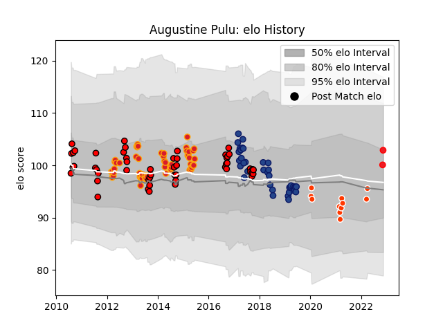

---  
layout: page  
title: Augustine Pulu  
date: 2022-11-16 11:27:37.452419  
categories: player  
---
# Augustine Pulu

## Positions: SH

## Country: Tonga

## Current elo: 103.0

## Current Percentile: 68.0

# Elo History

# Match History

| Team              |   Appearances |   Win Rate |
|:------------------|--------------:|-----------:|
| Chiefs            |            55 |   0.690909 |
| Counties Manukau  |            51 |   0.568627 |
| Blues             |            37 |   0.351351 |
| Hino Red Dolphins |            11 |   0.181818 |
| Tonga             |             2 |   1        |

| Opponent                        |   Matches |   Win Rate |
|:--------------------------------|----------:|-----------:|
| Crusaders                       |        13 |   0.461538 |
| Hurricanes                      |        11 |   0.363636 |
| Highlanders                     |        10 |   0.4      |
| Brumbies                        |         7 |   0.571429 |
| Blues                           |         6 |   1        |
| Waikato                         |         6 |   0.333333 |
| Western Force                   |         5 |   0.8      |
| Tasman                          |         5 |   0.4      |
| Cheetahs                        |         5 |   0.9      |
| Melbourne Rebels                |         5 |   0.6      |
| Hawke's Bay                     |         5 |   0.6      |
| Northland                       |         4 |   1        |
| New South Wales Waratahs        |         4 |   0.75     |
| Stormers                        |         4 |   0.5      |
| Queensland Reds                 |         4 |   0.25     |
| Sharks                          |         4 |   0.5      |
| Taranaki                        |         4 |   0.375    |
| Wellington                      |         4 |   0.5      |
| Bay of Plenty                   |         4 |   0.625    |
| Auckland                        |         4 |   0.75     |
| Chiefs                          |         4 |   0.375    |
| Bulls                           |         4 |   0.75     |
| Canterbury                      |         4 |   0.25     |
| Manawatu                        |         3 |   0.666667 |
| Otago                           |         3 |   0.666667 |
| Southland                       |         3 |   0.666667 |
| Jaguares                        |         2 |   0        |
| North Harbour                   |         2 |   1        |
| Green Rockets Tokatsu           |         2 |   1        |
| Sunwolves                       |         2 |   0.5      |
| Black Rams Tokyo                |         1 |   0        |
| British and Irish Lions         |         1 |   1        |
| Urayasu D-Rocks                 |         1 |   0        |
| Toyota Verblitz                 |         1 |   0        |
| Southern Kings                  |         1 |   1        |
| Spain                           |         1 |   1        |
| Kobelco Kobe Steelers           |         1 |   0        |
| Shizuoka Blue Revs              |         1 |   0        |
| Chile                           |         1 |   1        |
| Saitama Wild Knights            |         1 |   0        |
| Hanazono Kintetsu Liners        |         1 |   0        |
| NTT Docomo Red Hurricanes Osaka |         1 |   0        |
| Mitsubishi Dynaboars            |         1 |   0        |