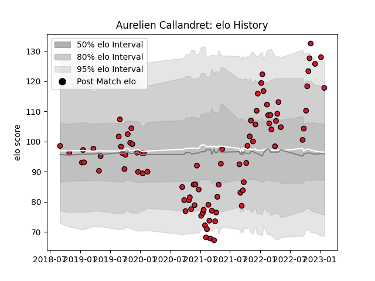

---  
layout: page  
title: Aurelien Callandret  
date: 2023-03-21 18:50:00.391713  
categories: player  
---
# Aurelien Callandret

Last updated: 2023-03-21
## Positions: W, FB

## Current elo: 110.0

## Current Percentile: 87.0

# Elo History

# Match History

| Team    |   Appearances |   Win Rate |
|:--------|--------------:|-----------:|
| Oyonnax |            97 |   0.659794 |

| Opponent                   |   Matches |   Win Rate |
|:---------------------------|----------:|-----------:|
| Colomiers                  |         9 |   0.722222 |
| Beziers                    |         8 |   0.8125   |
| Vannes                     |         7 |   0.571429 |
| Provence Rugby             |         7 |   0.785714 |
| Nevers                     |         7 |   0.714286 |
| Carcassonne                |         7 |   0.857143 |
| Mont-de-Marsan             |         6 |   0.416667 |
| Rouen                      |         6 |   0.666667 |
| Montauban                  |         6 |   0.666667 |
| Grenoble                   |         5 |   0.4      |
| Bayonne                    |         5 |   0.2      |
| Aurillac                   |         4 |   0.5      |
| Biarritz Olympique         |         4 |   0.5      |
| Perpignan                  |         3 |   0.333333 |
| Soyaux-Angouleme           |         3 |   1        |
| Narbonne                   |         2 |   1        |
| US Bressane                |         2 |   1        |
| Valence Romans Drome Rugby |         2 |   1        |
| Massy                      |         1 |   1        |
| Brive                      |         1 |   0        |
| Roval Drome XV             |         1 |   1        |
| Agen                       |         1 |   1        |