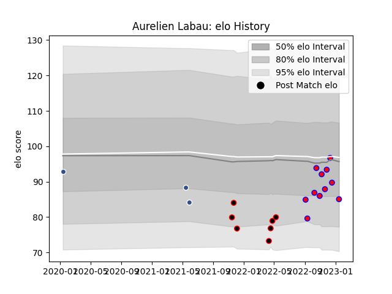

---  
layout: page  
title: Aurelien Labau  
date: 2023-03-17 17:31:27.889358  
categories: player  
---
# Aurelien Labau

## Positions: C

## Current elo: 108.0

## Current Percentile: 69.0

# Elo History

# Match History

| Team    |   Appearances |   Win Rate |
|:--------|--------------:|-----------:|
| Blagnac |             9 |   0.722222 |
| Nice    |             7 |   0.571429 |
| Agen    |             3 |   0        |

| Opponent                   |   Matches |   Win Rate |
|:---------------------------|----------:|-----------:|
| Chambery                   |         2 |        0.5 |
| Cognac Saint Jean d'Angély |         2 |        1   |
| Dax                        |         2 |        0.5 |
| Suresnes                   |         2 |        1   |
| Valence Romans Drome Rugby |         2 |        0   |
| Albi                       |         1 |        1   |
| Aubenas                    |         1 |        1   |
| Carqueiranne-Hyères        |         1 |        1   |
| La Rochelle                |         1 |        0   |
| Narbonne                   |         1 |        0.5 |
| Nice                       |         1 |        0   |
| Racing 92                  |         1 |        0   |
| Rennes                     |         1 |        1   |
| Wasps                      |         1 |        0   |