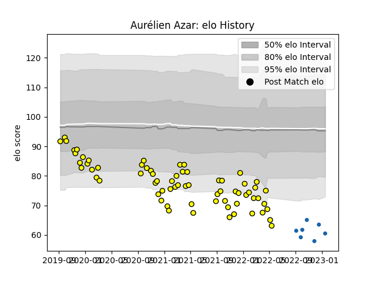

---  
layout: page  
title: Aurélien Azar  
date: 2022-12-18 16:31:30.520406  
categories: player  
---
# Aurélien Azar

## Positions: P

## Current elo: 79.0

## Current Percentile: 2.0

# Elo History

# Match History

| Team              |   Appearances |   Win Rate |
|:------------------|--------------:|-----------:|
| Carcassonne       |            38 |   0.5      |
| Castres Olympique |             6 |   0.166667 |

| Opponent                   |   Matches |   Win Rate |
|:---------------------------|----------:|-----------:|
| Aurillac                   |         4 |   0.5      |
| Nevers                     |         4 |   0.5      |
| Provence Rugby             |         3 |   0.333333 |
| Beziers                    |         3 |   1        |
| Mont-de-Marsan             |         3 |   0        |
| Agen                       |         2 |   0.5      |
| Bayonne                    |         2 |   0.5      |
| Valence Romans Drome Rugby |         2 |   0        |
| US Bressane                |         2 |   1        |
| Grenoble                   |         2 |   0        |
| Rouen                      |         2 |   1        |
| Montauban                  |         2 |   1        |
| Oyonnax                    |         2 |   0        |
| Toulon                     |         1 |   0        |
| Soyaux-Angouleme           |         1 |   1        |
| Racing 92                  |         1 |   0        |
| Narbonne                   |         1 |   1        |
| Perpignan                  |         1 |   0        |
| La Rochelle                |         1 |   0        |
| Edinburgh                  |         1 |   0        |
| Colomiers                  |         1 |   0        |
| Brive                      |         1 |   1        |
| Biarritz Olympique         |         1 |   1        |
| Vannes                     |         1 |   0        |