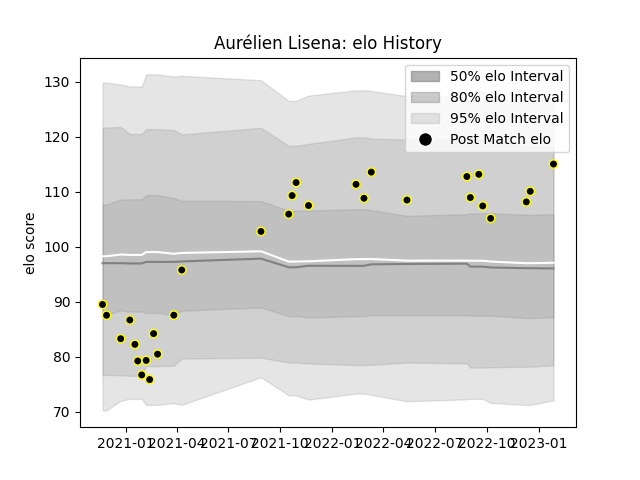

---  
layout: page  
title: Aurélien Lisena  
date: 2023-01-27 11:06:50.818331  
categories: player  
---
# Aurélien Lisena

## Positions: FL

## Current elo: 115.0

## Current Percentile: 73.0

# Elo History

# Match History

| Team           |   Appearances |   Win Rate |
|:---------------|--------------:|-----------:|
| Mont-de-Marsan |            30 |       0.65 |

| Opponent                   |   Matches |   Win Rate |
|:---------------------------|----------:|-----------:|
| Aurillac                   |         4 |   0.75     |
| Montauban                  |         4 |   0        |
| Carcassonne                |         3 |   0.666667 |
| Oyonnax                    |         3 |   0.833333 |
| Rouen                      |         3 |   1        |
| Nevers                     |         2 |   0.5      |
| Provence Rugby             |         2 |   0.5      |
| Soyaux-Angouleme           |         2 |   1        |
| Agen                       |         1 |   1        |
| Beziers                    |         1 |   0        |
| Grenoble                   |         1 |   1        |
| Narbonne                   |         1 |   1        |
| Perpignan                  |         1 |   0        |
| US Bressane                |         1 |   1        |
| Valence Romans Drome Rugby |         1 |   1        |