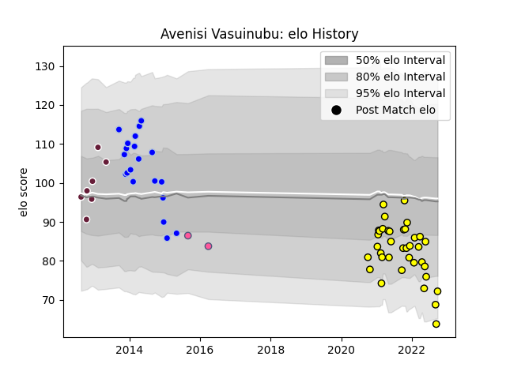

---  
layout: page  
title: Avenisi Vasuinubu  
date: 2023-03-20 15:47:25.418225  
categories: player  
---
# Avenisi Vasuinubu

Last updated: 2023-03-20
## Positions: W

## Current elo: 72.0

## Current Percentile: 4.0

# Elo History

# Match History

| Team                 |   Appearances |   Win Rate |
|:---------------------|--------------:|-----------:|
| Albi                 |            37 |   0.594595 |
| Colomiers            |            20 |   0.4      |
| Bordeaux Begles      |             7 |   0.142857 |
| Stade Francais Paris |             2 |   0        |

| Opponent                   |   Matches |   Win Rate |
|:---------------------------|----------:|-----------:|
| Blagnac                    |         4 |   0.5      |
| Bourgoin-Jallieu           |         4 |   0.75     |
| Narbonne                   |         4 |   0.75     |
| Cognac Saint Jean d'Angély |         4 |   0.75     |
| Dax                        |         4 |   0.75     |
| Agen                       |         3 |   0.333333 |
| US Bressane                |         3 |   0.666667 |
| Suresnes                   |         3 |   0.666667 |
| Nice                       |         3 |   0.333333 |
| Chambery                   |         3 |   1        |
| Mont-de-Marsan             |         3 |   0.333333 |
| Massy                      |         2 |   0.5      |
| Tarbes                     |         2 |   0        |
| Soyaux-Angouleme           |         2 |   0        |
| Valence Romans Drome Rugby |         2 |   0.5      |
| Aurillac                   |         2 |   1        |
| Beziers                    |         2 |   0        |
| Grenoble                   |         1 |   0        |
| Albi                       |         1 |   0        |
| Aubenas                    |         1 |   1        |
| Toulon                     |         1 |   1        |
| Stade Toulousain           |         1 |   0        |
| Biarritz Olympique         |         1 |   0        |
| Rennes                     |         1 |   1        |
| Perpignan                  |         1 |   0        |
| Pau                        |         1 |   0        |
| Brive                      |         1 |   0        |
| Carcassonne                |         1 |   0        |
| Clermont Auvergne          |         1 |   0        |
| Gloucester Rugby           |         1 |   0        |
| Lyon                       |         1 |   0        |
| London Irish               |         1 |   0        |
| La Rochelle                |         1 |   0        |