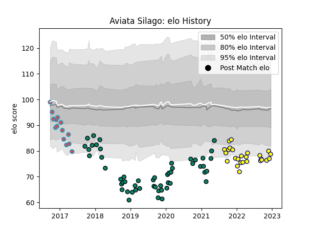

---  
layout: page  
title: Aviata Silago  
date: 2022-12-12 15:11:57.297942  
categories: player  
---
# Aviata Silago

## Positions: C, FH

## Current elo: 77.0

## Current Percentile: 4.0

# Elo History

# Match History

| Team             |   Appearances |   Win Rate |
|:-----------------|--------------:|-----------:|
| Montauban        |            53 |  0.481132  |
| Nevers           |            25 |  0.56      |
| Bourgoin-Jallieu |            14 |  0.0714286 |

| Opponent                   |   Matches |   Win Rate |
|:---------------------------|----------:|-----------:|
| Soyaux-Angouleme           |         9 |   0.722222 |
| Vannes                     |         8 |   0.5      |
| Biarritz Olympique         |         7 |   0.357143 |
| Oyonnax                    |         6 |   0.5      |
| Beziers                    |         6 |   0.333333 |
| Grenoble                   |         6 |   0.416667 |
| Carcassonne                |         6 |   0.166667 |
| Colomiers                  |         5 |   0.4      |
| Mont-de-Marsan             |         5 |   0.2      |
| Bayonne                    |         4 |   0.25     |
| Perpignan                  |         4 |   0        |
| Aurillac                   |         4 |   0.75     |
| Rouen                      |         3 |   1        |
| Brive                      |         2 |   0.5      |
| Albi                       |         2 |   0        |
| Montauban                  |         2 |   0        |
| Provence Rugby             |         2 |   0.5      |
| Roval Drome XV             |         2 |   1        |
| US Bressane                |         2 |   1        |
| Agen                       |         2 |   0        |
| Dax                        |         1 |   1        |
| Massy                      |         1 |   1        |
| Narbonne                   |         1 |   1        |
| Nevers                     |         1 |   0        |
| Valence Romans Drome Rugby |         1 |   0        |