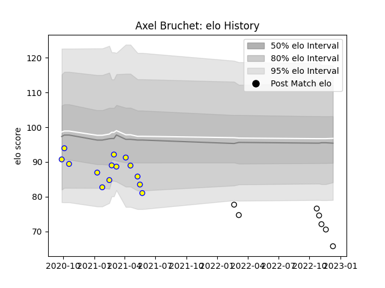

---  
layout: page  
title: Axel Bruchet  
date: 2022-12-14 11:31:47.064448  
categories: player  
---
# Axel Bruchet

## Positions: FL, N8

## Current elo: 66.0

## Current Percentile: 2.0

# Elo History

# Match History

| Team                       |   Appearances |   Win Rate |
|:---------------------------|--------------:|-----------:|
| Aubenas                    |            14 |   0.142857 |
| Valence Romans Drome Rugby |             7 |   0.357143 |

| Opponent                   |   Matches |   Win Rate |
|:---------------------------|----------:|-----------:|
| Albi                       |         3 |   0        |
| Blagnac                    |         3 |   0.333333 |
| Suresnes                   |         3 |   0.666667 |
| Chambery                   |         2 |   0        |
| Narbonne                   |         2 |   0.5      |
| Nice                       |         2 |   0        |
| Bourgoin-Jallieu           |         1 |   0.5      |
| Cognac Saint Jean d'Angély |         1 |   0        |
| Dax                        |         1 |   0        |
| Massy                      |         1 |   0        |
| Tarbes                     |         1 |   0        |
| US Bressane                |         1 |   0        |