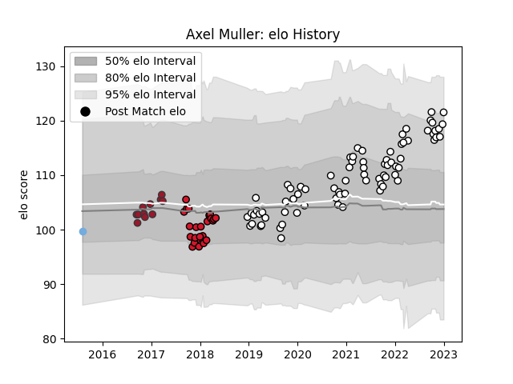

---  
layout: page  
title: Axel Muller  
date: 2023-02-02 18:59:53.834787  
categories: player  
---
# Axel Muller

## Positions: W

## Country: Argentina

## Current elo: 101.0

## Current Percentile: 67.0

# Elo History

# Match History

| Team      |   Appearances |   Win Rate |
|:----------|--------------:|-----------:|
| Brive     |            79 |   0.474684 |
| Oyonnax   |            24 |   0.25     |
| Toulon    |            11 |   0.5      |
| Argentina |             1 |   0        |

| Opponent             |   Matches |   Win Rate |
|:---------------------|----------:|-----------:|
| Pau                  |         9 |  0.444444  |
| Clermont Auvergne    |         9 |  0.611111  |
| Toulon               |         9 |  0.555556  |
| Lyon                 |         8 |  0.5       |
| Castres Olympique    |         7 |  0.285714  |
| Stade Francais Paris |         7 |  0.428571  |
| Racing 92            |         7 |  0.142857  |
| Bayonne              |         6 |  0.666667  |
| Montpellier Herault  |         6 |  0.0833333 |
| Stade Toulousain     |         6 |  0.333333  |
| La Rochelle          |         6 |  0.25      |
| Agen                 |         5 |  0.4       |
| Bordeaux Begles      |         5 |  0.6       |
| Biarritz Olympique   |         3 |  0.666667  |
| Brive                |         3 |  0.333333  |
| Connacht             |         2 |  0         |
| Grenoble             |         2 |  0.75      |
| US Bressane          |         1 |  0         |
| Uruguay              |         1 |  0         |
| Soyaux-Angouleme     |         1 |  1         |
| Vannes               |         1 |  1         |
| Saracens             |         1 |  0         |
| Massy                |         1 |  1         |
| Perpignan            |         1 |  1         |
| Nevers               |         1 |  1         |
| Mont-de-Marsan       |         1 |  1         |
| Aurillac             |         1 |  0         |
| Edinburgh            |         1 |  0         |
| Colomiers            |         1 |  0         |
| Carcassonne          |         1 |  1         |
| Beziers              |         1 |  0         |
| Worcester Warriors   |         1 |  0         |