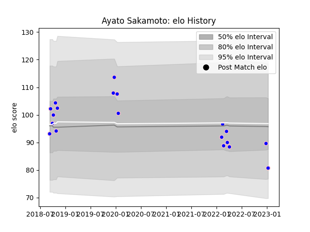

---  
layout: page  
title: Ayato Sakamoto  
date: 2022-12-28 12:55:18.005879  
categories: player  
---
# Ayato Sakamoto

## Positions: W, FB

## Current elo: 93.0

## Current Percentile: 37.0

# Elo History

# Match History

| Team              |   Appearances |   Win Rate |
|:------------------|--------------:|-----------:|
| Kurita Water Gush |            18 |   0.388889 |

| Opponent                         |   Matches |   Win Rate |
|:---------------------------------|----------:|-----------:|
| Chugoku Red Regulions            |         3 |   0.666667 |
| Hanazono Kintetsu Liners         |         2 |   0        |
| Kyuden Voltex                    |         2 |   0.5      |
| Mazda Blue Zoomers               |         2 |   1        |
| Munakata Sanix Blues             |         2 |   0        |
| Shimizu Blue Sharks              |         2 |   0.5      |
| Toyota Industries Shuttles Aichi |         2 |   0        |
| Kamaishi Seawaves                |         1 |   1        |
| Mitsubishi Dynaboars             |         1 |   0        |
| NTT Docomo Red Hurricanes Osaka  |         1 |   0        |