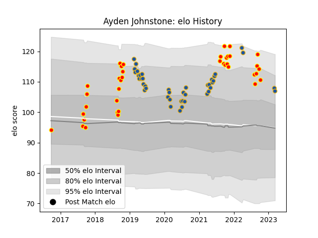

---  
layout: page  
title: Ayden Johnstone  
date: 2023-03-21 18:33:07.961117  
categories: player  
---
# Ayden Johnstone

Last updated: 2023-03-21
## Positions: P

## Current elo: 105.0

## Current Percentile: 84.0

# Elo History

# Match History

| Team        |   Appearances |   Win Rate |
|:------------|--------------:|-----------:|
| Highlanders |            43 |   0.418605 |
| Waikato     |            38 |   0.565789 |

| Opponent                 |   Matches |   Win Rate |
|:-------------------------|----------:|-----------:|
| Blues                    |         7 |   0.285714 |
| Crusaders                |         7 |   0.142857 |
| Chiefs                   |         6 |   0.583333 |
| Hurricanes               |         6 |   0.166667 |
| Northland                |         5 |   0.6      |
| Bay of Plenty            |         4 |   0.5      |
| Wellington               |         4 |   0.5      |
| Auckland                 |         3 |   0.666667 |
| Tasman                   |         3 |   1        |
| Taranaki                 |         3 |   0.666667 |
| Otago                    |         3 |   0.666667 |
| North Harbour            |         3 |   0.333333 |
| Melbourne Rebels         |         3 |   0.333333 |
| Hawke's Bay              |         3 |   0.5      |
| Manawatu                 |         2 |   0.5      |
| Counties Manukau         |         2 |   0.5      |
| Queensland Reds          |         2 |   1        |
| Canterbury               |         2 |   0        |
| Bulls                    |         2 |   0.25     |
| Brumbies                 |         2 |   1        |
| Western Force            |         2 |   1        |
| Lions                    |         1 |   0        |
| Moana Pasifika           |         1 |   1        |
| New South Wales Waratahs |         1 |   1        |
| Jaguares                 |         1 |   1        |
| Sharks                   |         1 |   0        |
| Southland                |         1 |   1        |
| Stormers                 |         1 |   0        |