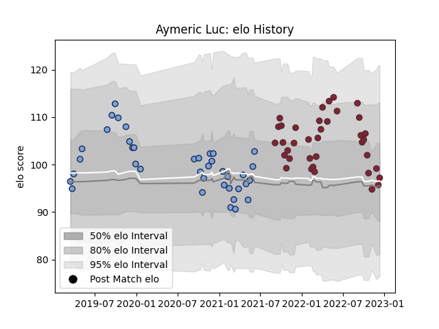

---  
layout: page  
title: Aymeric Luc  
date: 2023-01-06 00:23:06.618807  
categories: player  
---
# Aymeric Luc

## Positions: FB, W

## Current elo: 109.0

## Current Percentile: 75.0

# Elo History

# Match History

| Team    |   Appearances |   Win Rate |
|:--------|--------------:|-----------:|
| Bayonne |            43 |   0.406977 |
| Toulon  |            40 |   0.575    |

| Opponent             |   Matches |   Win Rate |
|:---------------------|----------:|-----------:|
| La Rochelle          |         6 |   0.333333 |
| Castres Olympique    |         6 |   0.333333 |
| Montpellier Herault  |         6 |   0.416667 |
| Lyon                 |         6 |   0.5      |
| Clermont Auvergne    |         6 |   0.5      |
| Racing 92            |         6 |   0.333333 |
| Brive                |         6 |   0.583333 |
| Stade Toulousain     |         5 |   0.4      |
| Stade Francais Paris |         5 |   0.6      |
| Pau                  |         5 |   0.5      |
| Bordeaux Begles      |         3 |   0.666667 |
| Toulon               |         3 |   0.333333 |
| Perpignan            |         3 |   0.333333 |
| Agen                 |         3 |   1        |
| Biarritz Olympique   |         2 |   1        |
| Bayonne              |         2 |   0.5      |
| Vannes               |         1 |   0        |
| Scarlets             |         1 |   0        |
| Soyaux-Angouleme     |         1 |   0        |
| Montauban            |         1 |   1        |
| Nevers               |         1 |   0        |
| Bath Rugby           |         1 |   1        |
| Mont-de-Marsan       |         1 |   0        |
| Massy                |         1 |   1        |
| Colomiers            |         1 |   1        |
| Zebre                |         1 |   1        |