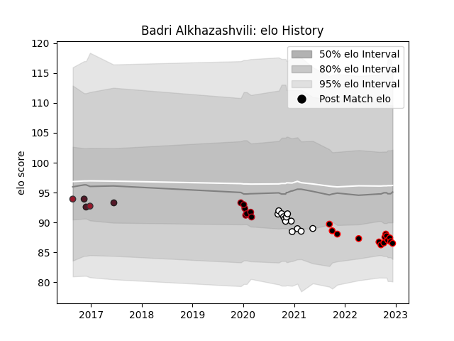

---  
layout: page  
title: Badri Alkhazashvili  
date: 2023-02-02 18:57:31.730177  
categories: player  
---
# Badri Alkhazashvili

## Positions: H

## Country: Georgia

## Current elo: 86.0

## Current Percentile: 20.0

# Elo History

# Match History

| Team           |   Appearances |   Win Rate |
|:---------------|--------------:|-----------:|
| Nice           |            30 |   0.516667 |
| Brive          |            13 |   0.307692 |
| Lyon           |             9 |   0.444444 |
| Georgia        |             8 |   0.75     |
| Provence Rugby |             4 |   0        |
| Toulon         |             2 |   0        |

| Opponent                   |   Matches |   Win Rate |
|:---------------------------|----------:|-----------:|
| Suresnes                   |         3 |   0.666667 |
| Chambery                   |         3 |   0.333333 |
| Blagnac                    |         3 |   0.666667 |
| Bourgoin-Jallieu           |         3 |   0.333333 |
| Pau                        |         3 |   1        |
| Narbonne                   |         2 |   0        |
| Soyaux-Angouleme           |         2 |   0.5      |
| Dax                        |         2 |   0.5      |
| Cognac Saint Jean d'Angély |         2 |   1        |
| Clermont Auvergne          |         2 |   0        |
| Racing 92                  |         2 |   0.5      |
| Brive                      |         2 |   0        |
| Bordeaux Begles            |         2 |   0.5      |
| Tarbes                     |         2 |   1        |
| Toulon                     |         2 |   0.5      |
| Bayonne                    |         2 |   0.5      |
| Montpellier Herault        |         2 |   0        |
| Valence Romans Drome Rugby |         2 |   0        |
| Russia                     |         1 |   1        |
| Romania                    |         1 |   1        |
| Agen                       |         1 |   1        |
| Samoa                      |         1 |   1        |
| Scotland                   |         1 |   0        |
| Northampton Saints         |         1 |   0        |
| Stade Toulousain           |         1 |   0        |
| US Bressane                |         1 |   0        |
| Spain                      |         1 |   1        |
| Leicester Tigers           |         1 |   0        |
| Massy                      |         1 |   0        |
| Lyon                       |         1 |   0        |
| Leinster                   |         1 |   0        |
| Albi                       |         1 |   0.5      |
| Japan                      |         1 |   0        |
| Germany                    |         1 |   1        |
| Dijon                      |         1 |   1        |
| Carqueiranne-Hyères        |         1 |   1        |
| Carcassonne                |         1 |   0        |
| Canada                     |         1 |   1        |
| Beziers                    |         1 |   0        |
| Benetton Treviso           |         1 |   0        |
| Aurillac                   |         1 |   0        |
| Aubenas                    |         1 |   1        |
| Zebre                      |         1 |   0        |