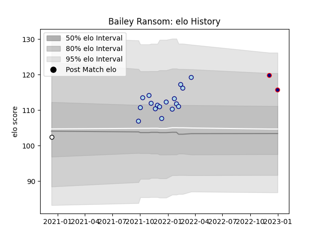

---  
layout: page  
title: Bailey Ransom  
date: 2023-01-06 00:22:49.179254  
categories: player  
---
# Bailey Ransom

## Positions: FL

## Current elo: 116.0

## Current Percentile: 88.0

# Elo History

# Match History

| Team              |   Appearances |   Win Rate |
|:------------------|--------------:|-----------:|
| Bedford           |            17 |   0.470588 |
| London Scottish   |             2 |   0.5      |
| Newcastle Falcons |             1 |   0        |

| Opponent            |   Matches |   Win Rate |
|:--------------------|----------:|-----------:|
| Ampthill            |         2 |        0.5 |
| Cornish Pirates     |         2 |        0   |
| Doncaster           |         2 |        0.5 |
| Ealing Trailfinders |         2 |        0.5 |
| Hartpury College    |         2 |        0.5 |
| Jersey              |         2 |        0.5 |
| London Scottish     |         2 |        1   |
| Richmond            |         2 |        0   |
| Caldy               |         1 |        1   |
| Cardiff Blues       |         1 |        0   |
| Coventry            |         1 |        0   |
| Nottingham          |         1 |        1   |