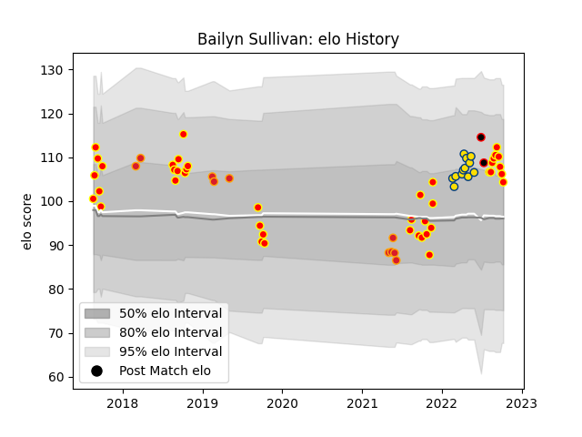

---  
layout: page  
title: Bailyn Sullivan  
date: 2023-03-21 18:44:23.289649  
categories: player  
---
# Bailyn Sullivan

Last updated: 2023-03-21
## Positions: C, W

## Country: New Zealand Maori

## Current elo: 104.0

## Current Percentile: 75.0

# Elo History

# Match History

| Team              |   Appearances |   Win Rate |
|:------------------|--------------:|-----------:|
| Waikato           |            42 |   0.511905 |
| Hurricanes        |            12 |   0.583333 |
| Chiefs            |            10 |   0.55     |
| New Zealand Maori |             2 |   0.5      |

| Opponent                 |   Matches |   Win Rate |
|:-------------------------|----------:|-----------:|
| Taranaki                 |         5 |   0.6      |
| Otago                    |         5 |   0.4      |
| Northland                |         5 |   0.6      |
| Hawke's Bay              |         4 |   0.375    |
| Wellington               |         4 |   0.25     |
| Tasman                   |         4 |   0.75     |
| Highlanders              |         4 |   0.625    |
| Auckland                 |         3 |   0.666667 |
| Manawatu                 |         3 |   0.333333 |
| Canterbury               |         3 |   0.333333 |
| Brumbies                 |         3 |   0.333333 |
| Blues                    |         3 |   0.666667 |
| Crusaders                |         2 |   0        |
| Ireland                  |         2 |   0.5      |
| Bay of Plenty            |         2 |   0.5      |
| North Harbour            |         2 |   0.5      |
| Counties Manukau         |         2 |   1        |
| Queensland Reds          |         2 |   0.5      |
| Western Force            |         2 |   0.5      |
| Fijian Drua              |         1 |   1        |
| Melbourne Rebels         |         1 |   1        |
| Moana Pasifika           |         1 |   1        |
| New South Wales Waratahs |         1 |   1        |
| Chiefs                   |         1 |   0        |
| Sunwolves                |         1 |   1        |