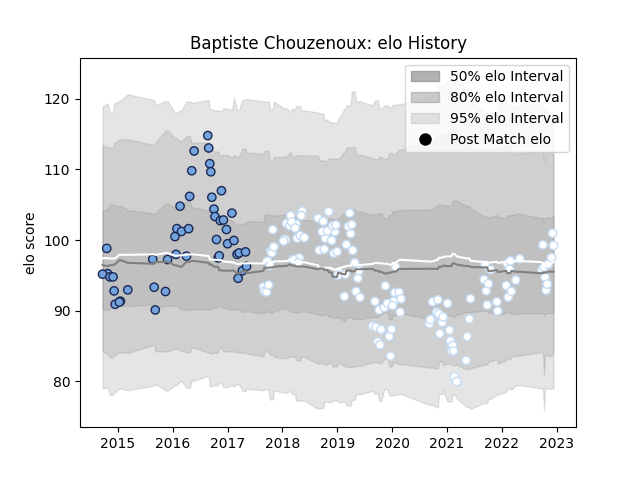

---  
layout: page  
title: Baptiste Chouzenoux  
date: 2022-12-09 13:17:26.673852  
categories: player  
---
# Baptiste Chouzenoux

## Positions: FL

## Current elo: 101.0

## Current Percentile: 54.0

# Elo History

# Match History

| Team      |   Appearances |   Win Rate |
|:----------|--------------:|-----------:|
| Racing 92 |           124 |    0.66129 |
| Bayonne   |            48 |    0.46875 |

| Opponent             |   Matches |   Win Rate |
|:---------------------|----------:|-----------:|
| La Rochelle          |        14 |   0.464286 |
| Clermont Auvergne    |        13 |   0.653846 |
| Pau                  |        12 |   0.708333 |
| Bordeaux Begles      |        12 |   0.5      |
| Castres Olympique    |        12 |   0.541667 |
| Lyon                 |        10 |   0.55     |
| Toulon               |        10 |   0.6      |
| Stade Toulousain     |         9 |   0.333333 |
| Stade Francais Paris |         9 |   0.666667 |
| Brive                |         8 |   0.875    |
| Montpellier Herault  |         8 |   0.75     |
| Grenoble             |         5 |   0.6      |
| Agen                 |         5 |   0.7      |
| Perpignan            |         4 |   0.75     |
| Munster              |         4 |   0.75     |
| Leicester Tigers     |         4 |   1        |
| Saracens             |         3 |   0.666667 |
| Racing 92            |         3 |   0        |
| Connacht             |         2 |   0        |
| Biarritz Olympique   |         2 |   0.5      |
| Tarbes               |         2 |   0.5      |
| Albi                 |         2 |   1        |
| Bayonne              |         2 |   0.5      |
| Colomiers            |         2 |   0.75     |
| Narbonne             |         2 |   1        |
| Oyonnax              |         1 |   1        |
| Scarlets             |         1 |   1        |
| Leinster             |         1 |   0        |
| Ospreys              |         1 |   1        |
| Montauban            |         1 |   0        |
| Mont-de-Marsan       |         1 |   1        |
| Gloucester Rugby     |         1 |   0        |
| Exeter Chiefs        |         1 |   1        |
| Dax                  |         1 |   0        |
| Carcassonne          |         1 |   1        |
| Bourgoin-Jallieu     |         1 |   1        |
| Beziers              |         1 |   1        |
| Ulster               |         1 |   0        |