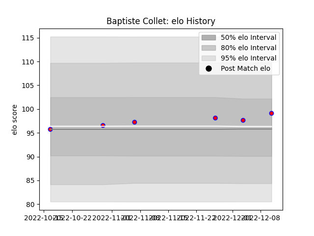

---  
layout: page  
title: Baptiste Collet  
date: 2023-01-30 11:44:56.305986  
categories: player  
---
# Baptiste Collet

## Positions: P, FL

## Current elo: 101.0

## Current Percentile: 56.0

# Elo History

# Match History

| Team    |   Appearances |   Win Rate |
|:--------|--------------:|-----------:|
| Blagnac |             7 |   0.857143 |
| Massy   |             3 |   0        |

| Opponent                   |   Matches |   Win Rate |
|:---------------------------|----------:|-----------:|
| Blagnac                    |         1 |          0 |
| Bourgoin-Jallieu           |         1 |          1 |
| Carqueiranne-Hyères        |         1 |          1 |
| Cognac Saint Jean d'Angély |         1 |          1 |
| Dijon                      |         1 |          0 |
| Narbonne                   |         1 |          0 |
| Nice                       |         1 |          0 |
| Rennes                     |         1 |          1 |
| Suresnes                   |         1 |          1 |
| US Bressane                |         1 |          1 |