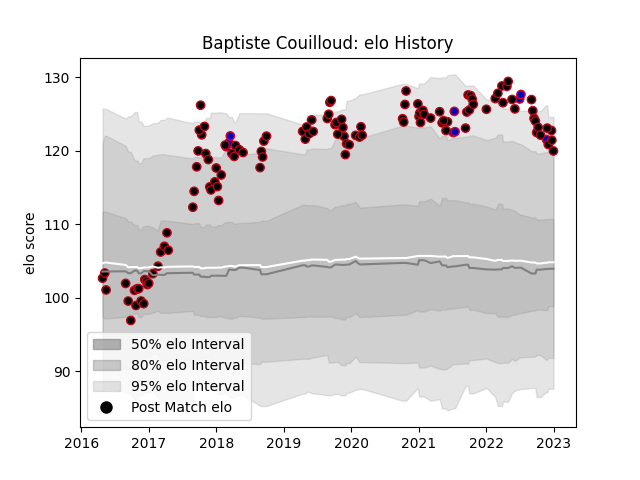

---  
layout: page  
title: Baptiste Couilloud  
date: 2022-12-18 16:28:05.279228  
categories: player  
---
# Baptiste Couilloud

## Positions: SH

## Country: France

## Current elo: 124.0

## Current Percentile: 97.0

# Elo History

# Match History

| Team   |   Appearances |   Win Rate |
|:-------|--------------:|-----------:|
| Lyon   |           112 |   0.526786 |
| France |             9 |   0.666667 |

| Opponent             |   Matches |   Win Rate |
|:---------------------|----------:|-----------:|
| Bordeaux Begles      |        12 |   0.5      |
| Montpellier Herault  |        10 |   0.7      |
| Stade Toulousain     |         8 |   0.6875   |
| Brive                |         8 |   0.625    |
| Castres Olympique    |         8 |   0.25     |
| Clermont Auvergne    |         8 |   0.25     |
| La Rochelle          |         7 |   0.428571 |
| Racing 92            |         7 |   0.428571 |
| Stade Francais Paris |         7 |   0.571429 |
| Toulon               |         6 |   0.5      |
| Pau                  |         5 |   0.5      |
| Agen                 |         4 |   0.75     |
| Bayonne              |         4 |   0.75     |
| Japan                |         3 |   1        |
| Grenoble             |         3 |   1        |
| Australia            |         3 |   0.333333 |
| Perpignan            |         3 |   1        |
| Newcastle Falcons    |         2 |   0.5      |
| Sale Sharks          |         1 |   0        |
| Oyonnax              |         1 |   1        |
| Saracens             |         1 |   0        |
| Leinster             |         1 |   0        |
| Ospreys              |         1 |   0        |
| Northampton Saints   |         1 |   0        |
| Narbonne             |         1 |   0        |
| Italy                |         1 |   1        |
| England              |         1 |   1        |
| Cardiff Blues        |         1 |   0        |
| Biarritz Olympique   |         1 |   1        |
| Benetton Treviso     |         1 |   1        |
| Wales                |         1 |   0        |