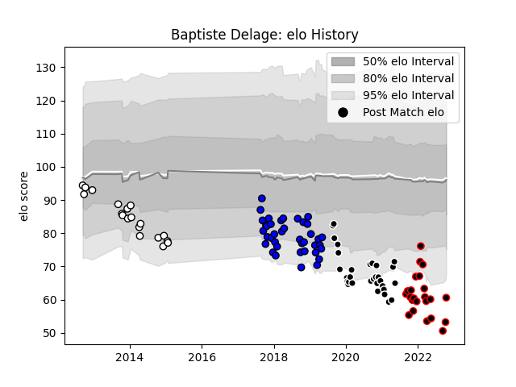

---  
layout: page  
title: Baptiste Delage  
date: 2023-01-17 11:41:51.423758  
categories: player  
---
# Baptiste Delage

## Positions: C, W

## Current elo: 64.0

## Current Percentile: 1.0

# Elo History

# Match History

| Team           |   Appearances |   Win Rate |
|:---------------|--------------:|-----------:|
| Massy          |            39 |   0.307692 |
| Provence Rugby |            31 |   0.467742 |
| Nice           |            23 |   0.543478 |
| Brive          |            19 |   0.421053 |

| Opponent                   |   Matches |   Win Rate |
|:---------------------------|----------:|-----------:|
| Vannes                     |         7 |   0.285714 |
| Montauban                  |         7 |   0.285714 |
| Colomiers                  |         6 |   0.333333 |
| Aurillac                   |         6 |   0.333333 |
| Oyonnax                    |         6 |   0        |
| Mont-de-Marsan             |         6 |   0.333333 |
| Soyaux-Angouleme           |         5 |   0.4      |
| Biarritz Olympique         |         5 |   0.5      |
| Perpignan                  |         5 |   0.4      |
| Valence Romans Drome Rugby |         4 |   0.5      |
| Bayonne                    |         4 |   0        |
| Carcassonne                |         4 |   0.75     |
| Albi                       |         3 |   0.833333 |
| Nevers                     |         3 |   0.333333 |
| Dax                        |         3 |   0.333333 |
| Grenoble                   |         3 |   0.666667 |
| Cognac Saint Jean d'Angély |         2 |   0.5      |
| Dijon                      |         2 |   0.5      |
| Gloucester Rugby           |         2 |   0        |
| Aubenas                    |         2 |   1        |
| Massy                      |         2 |   0.5      |
| Calvisano                  |         2 |   0.75     |
| Bucuresti                  |         2 |   1        |
| Newcastle Falcons          |         2 |   1        |
| US Bressane                |         2 |   0        |
| Suresnes                   |         2 |   0.5      |
| Beziers                    |         2 |   0        |
| Stade Toulousain           |         1 |   0        |
| Auch                       |         1 |   1        |
| Bath Rugby                 |         1 |   0        |
| Toulon                     |         1 |   0        |
| Tarbes                     |         1 |   1        |
| Blagnac                    |         1 |   1        |
| Rouen                      |         1 |   1        |
| Provence Rugby             |         1 |   1        |
| Chambery                   |         1 |   1        |
| Bourgoin-Jallieu           |         1 |   0        |
| Brive                      |         1 |   1        |
| Lyon                       |         1 |   0.5      |
| Zebre                      |         1 |   0        |