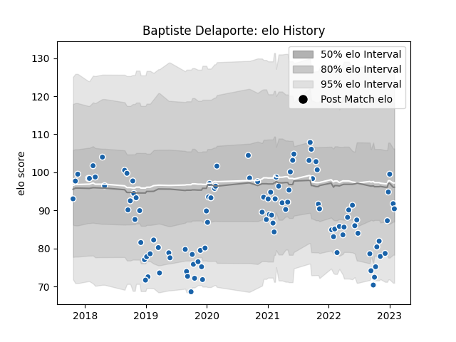

---  
layout: page  
title: Baptiste Delaporte  
date: 2023-02-02 18:51:19.181079  
categories: player  
---
# Baptiste Delaporte

## Positions: FL, N8

## Current elo: 90.0

## Current Percentile: 38.0

# Elo History

# Match History

| Team              |   Appearances |   Win Rate |
|:------------------|--------------:|-----------:|
| Castres Olympique |           106 |   0.584906 |

| Opponent             |   Matches |   Win Rate |
|:---------------------|----------:|-----------:|
| Pau                  |        10 |   0.8      |
| Bordeaux Begles      |         8 |   0.3125   |
| Clermont Auvergne    |         8 |   0.5      |
| Stade Toulousain     |         7 |   0.571429 |
| Racing 92            |         7 |   0.214286 |
| Montpellier Herault  |         7 |   0.857143 |
| Agen                 |         6 |   0.833333 |
| Toulon               |         6 |   0.333333 |
| Brive                |         6 |   0.666667 |
| Stade Francais Paris |         6 |   0.333333 |
| Lyon                 |         6 |   0.666667 |
| La Rochelle          |         5 |   0.6      |
| Perpignan            |         4 |   0.75     |
| Exeter Chiefs        |         3 |   0.333333 |
| Bayonne              |         3 |   1        |
| Worcester Warriors   |         2 |   1        |
| Munster              |         2 |   0        |
| Grenoble             |         2 |   1        |
| Biarritz Olympique   |         2 |   1        |
| Oyonnax              |         1 |   1        |
| RC Enisei            |         1 |   1        |
| Gloucester Rugby     |         1 |   0        |
| Edinburgh            |         1 |   0        |
| Dragons              |         1 |   1        |
| Leicester Tigers     |         1 |   0        |