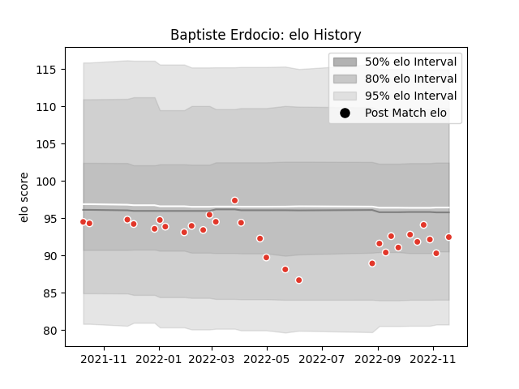

---  
layout: page  
title: Baptiste Erdocio  
date: 2022-11-22 11:27:25.292491  
categories: player  
---
# Baptiste Erdocio

## Positions: P

## Current elo: 92.0

## Current Percentile: 24.0

# Elo History

# Match History

| Team               |   Appearances |   Win Rate |
|:-------------------|--------------:|-----------:|
| Biarritz Olympique |            29 |   0.293103 |

| Opponent             |   Matches |   Win Rate |
|:---------------------|----------:|-----------:|
| Stade Francais Paris |         2 |        0.5 |
| Castres Olympique    |         2 |        0   |
| Clermont Auvergne    |         2 |        0   |
| Lyon                 |         2 |        0   |
| Montpellier Herault  |         2 |        0   |
| Agen                 |         1 |        0   |
| Nevers               |         1 |        0.5 |
| Toulon               |         1 |        0   |
| Stade Toulousain     |         1 |        0   |
| Rouen                |         1 |        0   |
| Racing 92            |         1 |        0   |
| Perpignan            |         1 |        0   |
| Pau                  |         1 |        0   |
| Oyonnax              |         1 |        1   |
| Montauban            |         1 |        1   |
| Aurillac             |         1 |        1   |
| Mont-de-Marsan       |         1 |        0   |
| Massy                |         1 |        1   |
| La Rochelle          |         1 |        1   |
| Colomiers            |         1 |        1   |
| Carcassonne          |         1 |        1   |
| Brive                |         1 |        0   |
| Bordeaux Begles      |         1 |        0   |
| Vannes               |         1 |        0   |