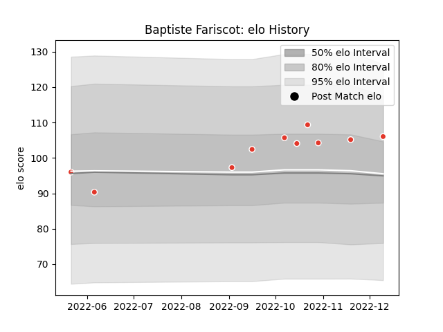

---  
layout: page  
title: Baptiste Fariscot  
date: 2022-11-22 11:45:59.694461  
categories: player  
---
# Baptiste Fariscot

## Positions: W

## Current elo: 101.0

## Current Percentile: 68.0

# Elo History

# Match History

| Team               |   Appearances |   Win Rate |
|:-------------------|--------------:|-----------:|
| Biarritz Olympique |             9 |   0.388889 |

| Opponent          |   Matches |   Win Rate |
|:------------------|----------:|-----------:|
| Agen              |         1 |        0   |
| Clermont Auvergne |         1 |        0   |
| Colomiers         |         1 |        1   |
| Massy             |         1 |        1   |
| Montauban         |         1 |        1   |
| Nevers            |         1 |        0.5 |
| Rouen             |         1 |        0   |
| Stade Toulousain  |         1 |        0   |
| Vannes            |         1 |        0   |