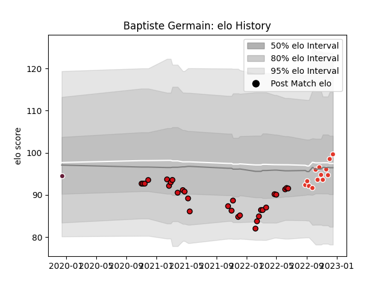

---  
layout: page  
title: Baptiste Germain  
date: 2023-03-21 18:09:55.134100  
categories: player  
---
# Baptiste Germain

Last updated: 2023-03-21
## Positions: SH, FH

## Current elo: 100.0

## Current Percentile: 53.0

# Elo History

# Match History

| Team               |   Appearances |   Win Rate |
|:-------------------|--------------:|-----------:|
| Stade Toulousain   |            30 |   0.483333 |
| Biarritz Olympique |            13 |   0.576923 |
| Bordeaux Begles    |             1 |   1        |

| Opponent             |   Matches |   Win Rate |
|:---------------------|----------:|-----------:|
| Agen                 |         3 |   0.666667 |
| Castres Olympique    |         3 |   0.166667 |
| Stade Francais Paris |         3 |   0        |
| Pau                  |         3 |   0.666667 |
| La Rochelle          |         3 |   1        |
| Toulon               |         2 |   0        |
| Racing 92            |         2 |   0.5      |
| Perpignan            |         2 |   0.5      |
| Montpellier Herault  |         2 |   0.5      |
| Lyon                 |         2 |   0        |
| Brive                |         2 |   1        |
| Bordeaux Begles      |         2 |   0.5      |
| Colomiers            |         1 |   1        |
| Bayonne              |         1 |   0        |
| Beziers              |         1 |   0        |
| Rouen                |         1 |   0        |
| Biarritz Olympique   |         1 |   1        |
| Provence Rugby       |         1 |   1        |
| Oyonnax              |         1 |   1        |
| Grenoble             |         1 |   0.5      |
| Carcassonne          |         1 |   1        |
| Montauban            |         1 |   1        |
| Mont-de-Marsan       |         1 |   0        |
| Massy                |         1 |   1        |
| Aurillac             |         1 |   1        |
| Cardiff Blues        |         1 |   1        |
| Vannes               |         1 |   0        |