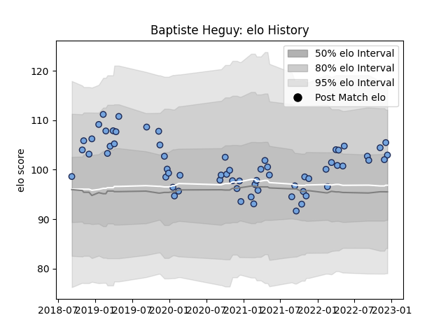

---  
layout: page  
title: Baptiste Heguy  
date: 2023-01-06 00:25:37.896005  
categories: player  
---
# Baptiste Heguy

## Positions: FL

## Current elo: 118.0

## Current Percentile: 82.0

# Elo History

# Match History

| Team    |   Appearances |   Win Rate |
|:--------|--------------:|-----------:|
| Bayonne |            84 |   0.464286 |

| Opponent             |   Matches |   Win Rate |
|:---------------------|----------:|-----------:|
| Toulon               |         5 |   0.4      |
| Agen                 |         4 |   0.75     |
| Oyonnax              |         4 |   0.5      |
| Vannes               |         4 |   0.75     |
| Clermont Auvergne    |         4 |   0.5      |
| Colomiers            |         4 |   0.75     |
| Racing 92            |         4 |   0.75     |
| Scarlets             |         3 |   0        |
| Nevers               |         3 |   0.5      |
| Narbonne             |         3 |   0.666667 |
| Montpellier Herault  |         3 |   0.333333 |
| Mont-de-Marsan       |         3 |   0        |
| Stade Francais Paris |         3 |   0.666667 |
| Lyon                 |         3 |   0.333333 |
| Provence Rugby       |         3 |   0.666667 |
| Carcassonne          |         3 |   0.333333 |
| Brive                |         3 |   0.166667 |
| Beziers              |         3 |   0.333333 |
| Pau                  |         3 |   0.166667 |
| Soyaux-Angouleme     |         2 |   0.5      |
| US Bressane          |         2 |   1        |
| Montauban            |         2 |   1        |
| Aurillac             |         2 |   0.5      |
| Castres Olympique    |         2 |   0        |
| Bordeaux Begles      |         2 |   0        |
| Biarritz Olympique   |         2 |   0        |
| Rouen                |         1 |   1        |
| Massy                |         1 |   1        |
| Leicester Tigers     |         1 |   0        |
| La Rochelle          |         1 |   0        |
| Zebre                |         1 |   0.5      |