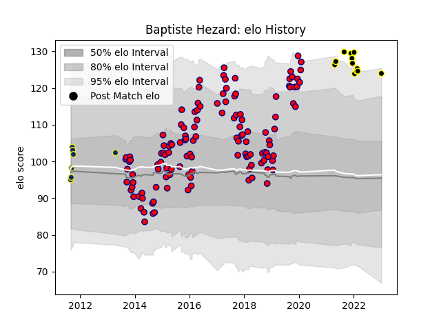

---  
layout: page  
title: Baptiste Hezard  
date: 2023-01-13 11:39:30.520683  
categories: player  
---
# Baptiste Hezard

## Positions: L

## Current elo: 124.0

## Current Percentile: 94.0

# Elo History

# Match History

| Team              |   Appearances |   Win Rate |
|:------------------|--------------:|-----------:|
| Aurillac          |           128 |   0.535156 |
| Mont-de-Marsan    |            12 |   0.75     |
| Clermont Auvergne |             7 |   0.785714 |

| Opponent           |   Matches |   Win Rate |
|:-------------------|----------:|-----------:|
| Mont-de-Marsan     |        11 |   0.454545 |
| Colomiers          |        11 |   0.272727 |
| Beziers            |        10 |   0.6      |
| Biarritz Olympique |         8 |   0.625    |
| Carcassonne        |         8 |   0.75     |
| Massy              |         6 |   0.666667 |
| Bayonne            |         6 |   0.5      |
| Narbonne           |         6 |   0.666667 |
| Montauban          |         6 |   0.75     |
| Dax                |         6 |   0.833333 |
| Tarbes             |         5 |   0.6      |
| Perpignan          |         5 |   0.6      |
| Albi               |         5 |   0.4      |
| Vannes             |         5 |   0.2      |
| Grenoble           |         5 |   0.2      |
| Bourgoin-Jallieu   |         5 |   0.6      |
| Lyon               |         4 |   0.5      |
| Oyonnax            |         4 |   0.75     |
| Pau                |         4 |   0.25     |
| Agen               |         4 |   1        |
| Nevers             |         4 |   0.25     |
| Rouen              |         3 |   1        |
| Soyaux-Angouleme   |         3 |   0.333333 |
| Provence Rugby     |         3 |   0.666667 |
| Toulon             |         2 |   0.75     |
| US Bressane        |         2 |   1        |
| Bordeaux Begles    |         1 |   1        |
| Aurillac           |         1 |   1        |
| La Rochelle        |         1 |   0        |
| Racing 92          |         1 |   1        |
| Stade Toulousain   |         1 |   0        |
| Auch               |         1 |   1        |