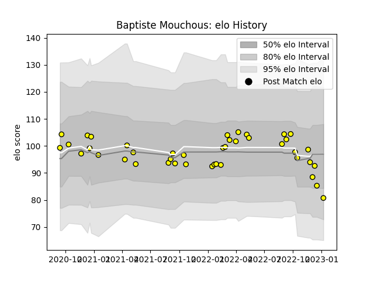

---  
layout: page  
title: Baptiste Mouchous  
date: 2022-11-22 11:27:31.312526  
categories: player  
---
# Baptiste Mouchous

## Positions: FH, FB

## Current elo: 85.0

## Current Percentile: 13.0

# Elo History

# Match History

| Team        |   Appearances |   Win Rate |
|:------------|--------------:|-----------:|
| Carcassonne |            21 |   0.357143 |

| Opponent                   |   Matches |   Win Rate |
|:---------------------------|----------:|-----------:|
| Beziers                    |         2 |       0.5  |
| Biarritz Olympique         |         2 |       0    |
| Colomiers                  |         2 |       0    |
| Oyonnax                    |         2 |       0    |
| Provence Rugby             |         2 |       0.5  |
| Soyaux-Angouleme           |         2 |       0.5  |
| Vannes                     |         2 |       0.75 |
| Grenoble                   |         1 |       0    |
| Massy                      |         1 |       0    |
| Mont-de-Marsan             |         1 |       1    |
| Montauban                  |         1 |       1    |
| Nevers                     |         1 |       0    |
| Rouen                      |         1 |       1    |
| Valence Romans Drome Rugby |         1 |       0    |