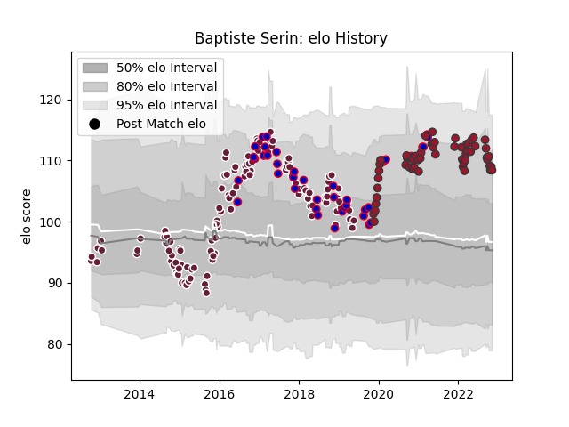

---  
layout: page  
title: Baptiste Serin  
date: 2022-12-09 13:22:25.408914  
categories: player  
---
# Baptiste Serin

## Positions: SH, FH

## Country: France

## Current elo: 108.0

## Current Percentile: 85.0

# Elo History

# Match History

| Team            |   Appearances |   Win Rate |
|:----------------|--------------:|-----------:|
| Bordeaux Begles |           121 |   0.454545 |
| Toulon          |            57 |   0.649123 |
| France          |            43 |   0.476744 |

| Opponent                 |   Matches |   Win Rate |
|:-------------------------|----------:|-----------:|
| Racing 92                |        14 |   0.357143 |
| Lyon                     |        13 |   0.692308 |
| Clermont Auvergne        |        12 |   0.541667 |
| Castres Olympique        |        12 |   0.416667 |
| Montpellier Herault      |        11 |   0.318182 |
| Stade Toulousain         |        11 |   0.454545 |
| Pau                      |        11 |   0.681818 |
| Brive                    |        10 |   0.6      |
| La Rochelle              |         9 |   0.333333 |
| Stade Francais Paris     |         9 |   0.444444 |
| Bayonne                  |         7 |   0.714286 |
| Toulon                   |         7 |   0.428571 |
| Scotland                 |         6 |   0.5      |
| Wales                    |         6 |   0.666667 |
| Italy                    |         5 |   1        |
| South Africa             |         5 |   0        |
| Perpignan                |         5 |   0.7      |
| New Zealand              |         5 |   0        |
| Agen                     |         5 |   0.8      |
| Bordeaux Begles          |         5 |   0.6      |
| Ireland                  |         4 |   0.5      |
| Oyonnax                  |         4 |   0.5      |
| Grenoble                 |         4 |   0.5      |
| London Irish             |         4 |   0.5      |
| Exeter Chiefs            |         4 |   0.5      |
| Argentina                |         3 |   0.666667 |
| Scarlets                 |         3 |   1        |
| England                  |         3 |   0.333333 |
| Dragons                  |         2 |   0.5      |
| Edinburgh                |         2 |   0        |
| Ospreys                  |         2 |   0.5      |
| Mont-de-Marsan           |         2 |   0        |
| Gloucester Rugby         |         2 |   0        |
| London Welsh             |         2 |   1        |
| Fiji                     |         1 |   0        |
| Japan                    |         1 |   0.5      |
| Sale Sharks              |         1 |   1        |
| Samoa                    |         1 |   1        |
| Mogliano                 |         1 |   1        |
| Connacht                 |         1 |   0        |
| Bristol Rugby            |         1 |   0        |
| Biarritz Olympique       |         1 |   1        |
| Tonga                    |         1 |   1        |
| Australia                |         1 |   0        |
| Ulster                   |         1 |   1        |
| United States of America |         1 |   1        |