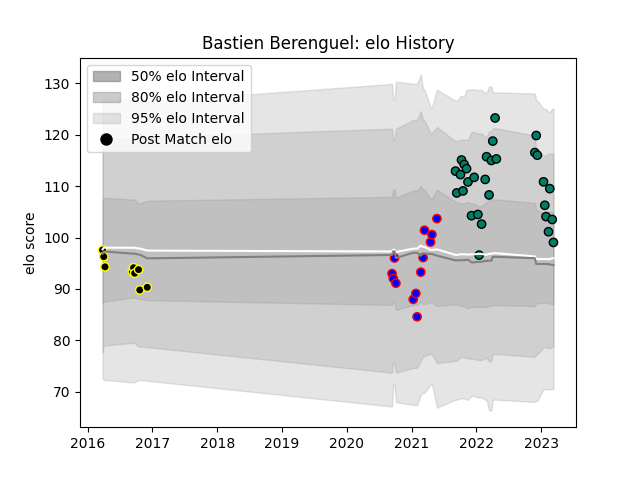

---  
layout: page  
title: Bastien Berenguel  
date: 2023-01-15 11:53:54.183007  
categories: player  
---
# Bastien Berenguel

## Positions: FL

## Current elo: 104.0

## Current Percentile: 79.0

# Elo History

# Match History

| Team           |   Appearances |   Win Rate |
|:---------------|--------------:|-----------:|
| Suresnes       |            25 |   0.52     |
| Dijon          |            13 |   0.384615 |
| Mont-de-Marsan |             9 |   0.555556 |

| Opponent                   |   Matches |   Win Rate |
|:---------------------------|----------:|-----------:|
| Blagnac                    |         4 |   0.5      |
| Bourgoin-Jallieu           |         4 |   0.5      |
| Cognac Saint Jean d'Angély |         4 |   0.75     |
| Dax                        |         4 |   0.25     |
| Narbonne                   |         3 |   0.333333 |
| Chambery                   |         3 |   1        |
| Dijon                      |         2 |   1        |
| US Bressane                |         2 |   0        |
| Tarbes                     |         2 |   1        |
| Soyaux-Angouleme           |         2 |   0        |
| Nice                       |         2 |   0.5      |
| Valence Romans Drome Rugby |         2 |   0        |
| Albi                       |         2 |   0.5      |
| Aubenas                    |         2 |   0.5      |
| Massy                      |         1 |   0        |
| Montauban                  |         1 |   0        |
| Carqueiranne-Hyères        |         1 |   0        |
| Provence Rugby             |         1 |   1        |
| Rennes                     |         1 |   1        |
| Beziers                    |         1 |   1        |
| Suresnes                   |         1 |   1        |
| Aurillac                   |         1 |   0        |
| Agen                       |         1 |   0        |