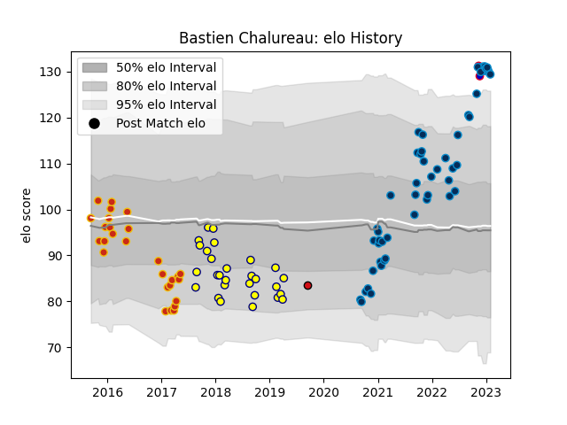

---  
layout: page  
title: Bastien Chalureau  
date: 2023-01-06 00:17:01.202561  
categories: player  
---
# Bastien Chalureau

## Positions: L

## Country: France

## Current elo: 123.0

## Current Percentile: 92.0

# Elo History

# Match History

| Team                |   Appearances |   Win Rate |
|:--------------------|--------------:|-----------:|
| Montpellier Herault |            47 |   0.521277 |
| Nevers              |            28 |   0.464286 |
| Perpignan           |            27 |   0.481481 |
| France              |             2 |   1        |
| Stade Toulousain    |             1 |   0        |

| Opponent             |   Matches |   Win Rate |
|:---------------------|----------:|-----------:|
| Biarritz Olympique   |         6 |   0.666667 |
| Lyon                 |         5 |   0.4      |
| Bayonne              |         5 |   0.4      |
| Bordeaux Begles      |         5 |   0.4      |
| Castres Olympique    |         4 |   0.5      |
| La Rochelle          |         4 |   0.25     |
| Perpignan            |         4 |   1        |
| Provence Rugby       |         4 |   0.5      |
| Clermont Auvergne    |         4 |   0.5      |
| Racing 92            |         4 |   0.5      |
| Aurillac             |         4 |   0.5      |
| Montauban            |         4 |   0.25     |
| Massy                |         3 |   0.666667 |
| Soyaux-Angouleme     |         3 |   0.333333 |
| Stade Toulousain     |         3 |   0.333333 |
| Toulon               |         3 |   0.5      |
| Pau                  |         3 |   0.333333 |
| Narbonne             |         3 |   0.666667 |
| Vannes               |         3 |   0.666667 |
| Carcassonne          |         3 |   0.333333 |
| Brive                |         3 |   0.666667 |
| Dax                  |         3 |   0.333333 |
| Colomiers            |         2 |   0.5      |
| US Bressane          |         2 |   0.5      |
| Beziers              |         2 |   0.5      |
| Bourgoin-Jallieu     |         2 |   1        |
| Stade Francais Paris |         2 |   1        |
| Albi                 |         2 |   0        |
| Oyonnax              |         2 |   0        |
| Mont-de-Marsan       |         1 |   0        |
| South Africa         |         1 |   1        |
| Grenoble             |         1 |   0        |
| Ospreys              |         1 |   0        |
| Tarbes               |         1 |   1        |
| Japan                |         1 |   1        |
| London Irish         |         1 |   1        |
| Agen                 |         1 |   1        |